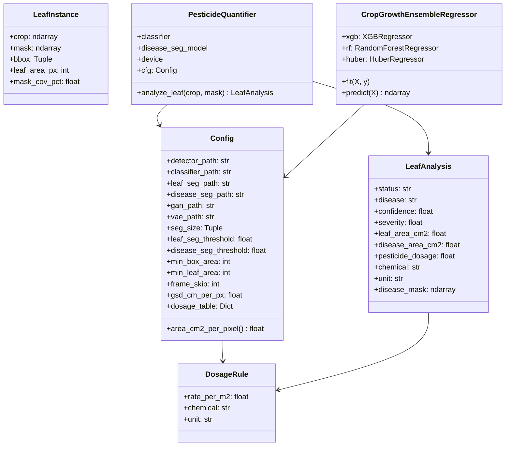
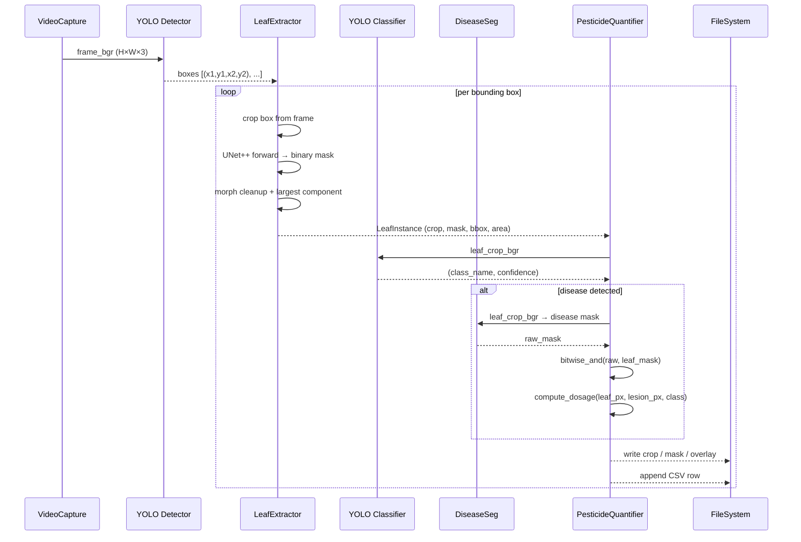
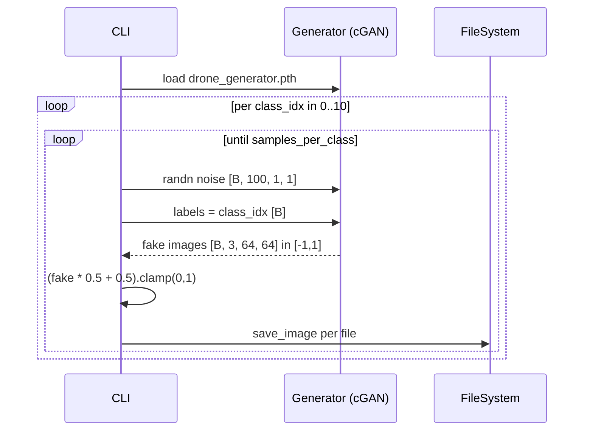
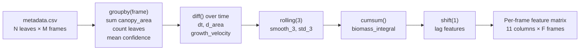

# Omni-AgriVision — Technical Architecture

> Deep reference for contributors and researchers. Covers data flow, component contracts, model specifications, and design decisions.

---

## Table of Contents

- [Component Overview](#component-overview)
- [Data Flow](#data-flow)
- [Module Contracts](#module-contracts)
- [Model Specifications](#model-specifications)
- [Dosage Computation](#dosage-computation)
- [Leaf Extraction Detail](#leaf-extraction-detail)
- [Growth Feature Engineering](#growth-feature-engineering)
- [Design Decisions](#design-decisions)
- [Known Limitations & Future Work](#known-limitations--future-work)

---

## Component Overview



---

## Data Flow

### Frame-Level Processing



### Synthetic Generation Flow



---

## Module Contracts

### `leaf_extraction.py`

**`extract_leaves(frame_bgr, boxes, leaf_seg_model, device, cfg) → List[LeafInstance]`**

For each bounding box:
1. Clamp to frame bounds; skip if area < `cfg.min_box_area`
2. Run `segment_binary` (UNet++) → binary mask at 512×512 → resize back to box size
3. If model is `None`, fall back to `leaf_mask_fallback` (Excess Green index + Otsu threshold)
4. Apply morphological open → close (3×3 kernel) to remove noise
5. Keep only the largest connected component
6. Tighten bbox to actual mask extent; skip if leaf area < `cfg.min_leaf_area`
7. Apply mask to get isolated leaf crop; compute `mask_cov_pct`

**`segment_binary(model, crop_bgr, device, size, threshold) → ndarray`**

- Resize crop to `size`, normalise with ImageNet mean/std
- Single forward pass under `torch.no_grad()`
- Apply `sigmoid` → threshold → resize back (nearest-neighbour)

---

### `pesticide.py`

**`compute_dosage(leaf_area_px, lesion_px, class_name, cfg) → Tuple`**

Pure function — no models, fully unit-testable.

```
area_per_px  = gsd_cm_per_px²            # cm² per pixel
leaf_cm²     = leaf_area_px × area_per_px
disease_cm²  = lesion_px × area_per_px
severity     = clamp(lesion_px / leaf_area_px, 0, 1)
leaf_m²      = leaf_cm² / 10_000
dosage       = leaf_m² × rule.rate_per_m2 × severity
```

The `severity` multiplier means a leaf with 100% lesion coverage gets the full rate; a leaf with 10% gets 10% of the rate.

**`PesticideQuantifier.analyze_leaf(leaf_crop_bgr, leaf_mask) → LeafAnalysis`**

1. Run YOLO classifier on the raw leaf crop
2. If `"healthy"` in class name → return zero-dosage record immediately
3. Otherwise → run DeepLabV3+ → AND with leaf mask → call `compute_dosage`

---

### `growth.py`

**`engineer_features(df) → DataFrame`**

Groups the per-leaf `metadata.csv` into per-frame aggregates, then computes:

| Feature | Formula |
|---|---|
| `total_canopy_area` | `sum(w × h × mask_cov% / 100)` |
| `leaf_count` | `count(leaf)` |
| `mean_conf` | `mean(conf_%)` |
| `mean_mask_cov` | `mean(mask_cov_%)` |
| `dt` | `diff(time_sec)` |
| `growth_velocity` | `d_area / dt` (0 if dt=0) |
| `canopy_area_smooth_3` | rolling(3).mean() |
| `canopy_area_std_3` | rolling(3).std() |
| `biomass_integral` | `cumsum(total_canopy_area)` |
| `canopy_area_lag_1` | `shift(1)` |
| `leaf_count_lag_1` | `shift(1)` |

---

## Model Specifications

### YOLO Models

| Model | Role | Input | Notes |
|---|---|---|---|
| `yolo_detector.pt` | Leaf bounding boxes | Full video frame | Streamed inference with `stream=True` |
| `yolo_classifier.pt` | Disease classification | Per-leaf crop | Uses `probs.top1` + `probs.top1conf` |

Both loaded via `ultralytics.YOLO`. The detector is moved to the target device; the classifier uses its default device.

---

### UNet++ — Leaf Segmentation

```
Encoder: EfficientNet-B3 (pretrained weights = None at inference)
Decoder: UNet++ nested skip connections
in_channels: 3
classes: 1  (binary)
Activation: sigmoid (applied externally with threshold)
Input resolution: 512 × 512
Threshold: 0.5 (cfg.leaf_seg_threshold)
```

---

### DeepLabV3+ — Disease Segmentation

```
Encoder: ResNet-50 (pretrained weights = None at inference)
Decoder: DeepLabV3+ with ASPP
in_channels: 3
classes: 1  (binary)
Activation: sigmoid (applied externally with threshold)
Input resolution: 512 × 512
Threshold: 0.4 (cfg.disease_seg_threshold)
```

Lower threshold (0.4) for disease segmentation deliberately errs toward inclusion — missing a lesion is worse than slightly over-segmenting.

---

### Conditional GAN

```
Generator:
  Input:  noise [B, 100, 1, 1]  +  label embedding [B, 100, 1, 1]
  Concat: [B, 200, 1, 1]
  Layers: 5 × ConvTranspose2d with BN + ReLU, final Tanh
  Output: [B, 3, 64, 64] in [-1, 1]

Discriminator:
  Input: image [B, 3, 64, 64]  +  label embedding reshaped to [B, 1, 64, 64]
  Concat: [B, 4, 64, 64]
  Layers: 5 × Conv2d with BN + LeakyReLU(0.2), final Sigmoid
  Output: [B, 1] — real/fake probability

Training:
  Loss:    BCE
  Opt:     Adam (β1=0.5, β2=0.999)
  Stage 1: LR=2e-4, 10 epochs on PlantVillage 38-class
  Stage 2: LR=5e-5, 30 epochs fine-tune on drone 11-class
```

---

### VAE

```
Encoder:
  4 × Conv2d (stride=2): 3→32→64→128→256 channels
  Spatial: 128×128 → 64 → 32 → 16 → 8×8
  fc_mu, fc_logvar: 256×8×8 → 128

Reparameterization:
  z = μ + ε·exp(0.5·logvar),  ε ~ N(0, I)

Decoder:
  fc: 128 → 256×8×8
  4 × ConvTranspose2d (stride=2): 256→128→64→32→3 channels
  Spatial: 8×8 → 16 → 32 → 64 → 128×128
  Final activation: Sigmoid → [0, 1]
```

---

## Dosage Computation

The dosage formula converts pixel measurements to real-world agronomic quantities:

```
pixel_area_cm²  = gsd_cm_per_px²             (Config.area_cm2_per_pixel)
leaf_area_cm²   = leaf_area_px × pixel_area_cm²
lesion_cm²      = lesion_px × pixel_area_cm²
severity        = clamp(lesion_px / leaf_area_px, 0.0, 1.0)
leaf_area_m²    = leaf_area_cm² / 10,000
dosage          = leaf_area_m² × rule.rate_per_m2 × severity
```

**Example** (`gsd=0.05 cm/px`, `Tomato___Late_blight`, `Mancozeb 0.70 ml/m²`):

- Leaf: 400×300 px masked area = 80,000 px  
- Lesion: 20,000 px  
- `leaf_cm²` = 80,000 × 0.0025 = 200 cm²  
- `severity` = 20,000 / 80,000 = 0.25  
- `leaf_m²` = 200 / 10,000 = 0.02 m²  
- `dosage` = 0.02 × 0.70 × 0.25 = **0.0035 ml**

Summation across all diseased leaves in a field gives the total treatment requirement.

---

## Leaf Extraction Detail

### ExG Fallback (no segmentation model)

When `leaf_seg_model` is `None`, the system falls back to the Excess Green (ExG) vegetation index:

```
ExG = 2G - R - B
```

This separates green leaf material from soil and background without any learned model, using Otsu's method to find the optimal threshold automatically.

### Largest Component Filter

After morphological cleanup, only the single largest connected blob is retained:

```python
num, labels, stats, _ = cv2.connectedComponentsWithStats(mask, connectivity=8)
largest = 1 + argmax(stats[1:, CC_STAT_AREA])
mask = where(labels == largest, 255, 0)
```

This eliminates adjacent leaves, stems, and image artefacts that might bleed into the bounding box crop.

---

## Growth Feature Engineering

The feature engineering converts the frame-indexed aggregate time-series into a supervised regression dataset:



The `canopy_area` proxy `w × h × mask_cov% / 100` avoids the more expensive full pixel count while still being proportional to actual leaf area.

---

## Design Decisions

### Why UNet++ for leaf segmentation, not the YOLO instance segmenter?

YOLO instance segmentation produces a 160×160 low-res mask. UNet++ with EfficientNet-B3 at 512×512 gives substantially higher mask fidelity on small leaf textures and irregular shapes. The additional inference cost is acceptable because only detected bounding boxes are processed, not the full frame.

### Why separate leaf seg and disease seg models?

The two segmentation tasks have different class imbalances and false-positive costs:
- **Leaf seg** needs high recall (missing a leaf = dropping a data point) → threshold 0.5
- **Disease seg** needs high precision within the leaf (over-segmenting = over-dosing) → threshold 0.4 with AND masking against the leaf mask to eliminate false positives outside the leaf

### Why a two-stage GAN (PlantVillage → drone fine-tune)?

Drone imagery differs significantly from standard PlantVillage photos: aerial perspective, varying resolution, soil/shadow backgrounds, partial occlusion. Training from scratch on the smaller drone dataset alone would overfit. Pre-training on the large 38-class PlantVillage set gives the generator rich texture and colour priors; fine-tuning adapts the distribution to the aerial domain at much lower data cost.

### Why an embedding reset rather than full retraining on class mismatch?

The convolutional layers learn general image structure (edges, textures, disease patterns) that transfers well between class counts. Only the embedding layer `nn.Embedding(num_classes, embed_size)` is class-count-dependent. Resetting just that layer and keeping all conv weights is the minimal change required to adapt the class count, and the fine-tuning epochs then re-learn the class-conditional relationships.

### Why `severity × rate` rather than a flat dosage?

A flat dosage (apply maximum rate whenever any disease is detected) wastes chemicals and risks plant damage. The multiplicative formula approximates the BBCH-based integrated pest management approach: apply in proportion to the fraction of tissue actually affected.

---

## Known Limitations & Future Work

| Issue | Impact | Proposed Fix |
|---|---|---|
| `gsd_cm_per_px` is a global constant | Inaccurate area for non-nadir shots | Per-frame altitude from drone telemetry |
| `frame_skip` drops frames between processed ones | Missed leaves at video edges | Sliding window with deduplication by IoU |
| GAN output is 64×64 | Classifier may not benefit for fine-grained features | Upgrade to 256×256 with progressive growing GAN |
| Growth regressor has no temporal model | Cannot capture non-linear growth dynamics | Add LSTM layer or temporal transformer head |
| No tracking across frames | Same leaf counted multiple times | Integrate DeepSORT or ByteTrack |
| Dosage table is static | Does not account for resistance, local regulations | Parametric table loaded from YAML/database |
| VAE only models healthy leaves | Cannot augment disease classes | Train separate VAE per disease class |
