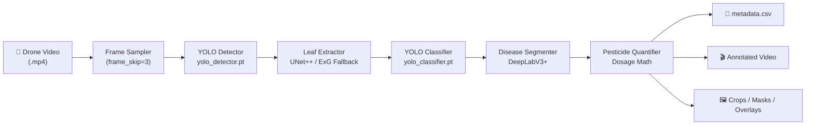
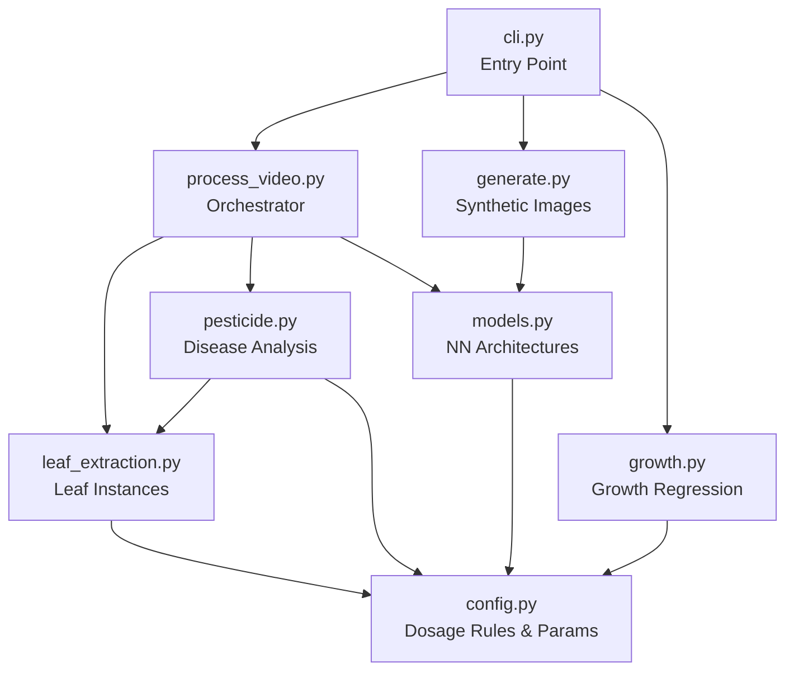
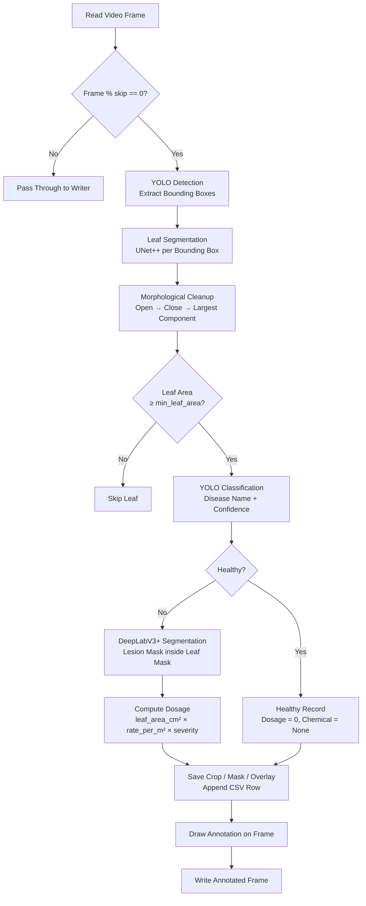
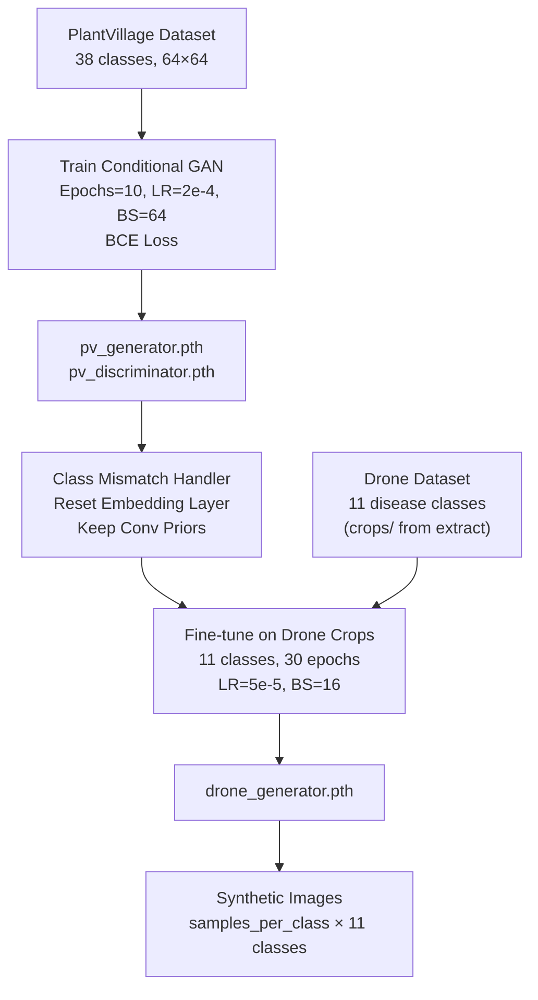
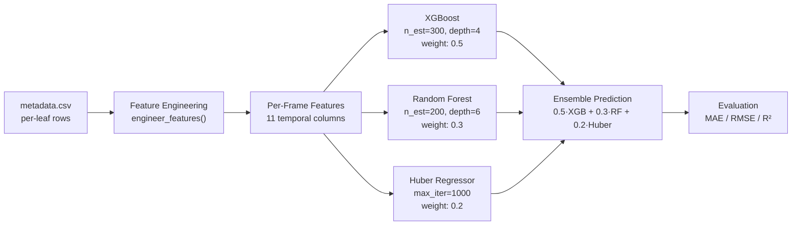
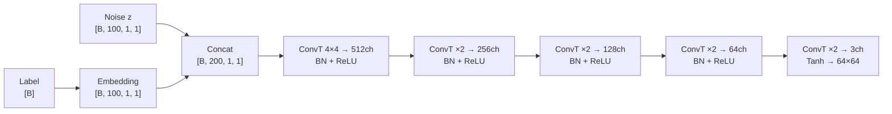
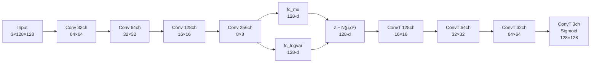

# 🌿 Omni-AgriVision

> **AI-powered agricultural drone analysis system** — real-time plant disease detection, precision pesticide quantification, and crop growth forecasting from drone video footage.

---

## 📋 Table of Contents

- [Overview](#overview)
- [Key Features](#key-features)
- [System Architecture](#system-architecture)
- [Project Structure](#project-structure)
- [Installation](#installation)
- [Quick Start](#quick-start)
- [CLI Reference](#cli-reference)
- [Model Stack](#model-stack)
- [Supported Diseases](#supported-diseases)
- [Output Structure](#output-structure)
- [Training Pipeline](#training-pipeline)
- [Growth Analysis](#growth-analysis)
- [Configuration](#configuration)

---

## Overview

Omni-AgriVision is an end-to-end computer vision pipeline that transforms raw drone video footage into actionable agronomic intelligence. It automatically detects individual leaves in each frame, classifies disease type and severity, segments lesion regions, computes precise pesticide dosages per leaf, and tracks canopy growth across time.

The system also includes a synthetic data generation module — both a Conditional GAN and a VAE — trained first on the 38-class PlantVillage benchmark, then fine-tuned on real drone crops, to augment training datasets for rare or underrepresented disease classes.

---

## Key Features

- **Real-time leaf detection** via YOLOv8 object detector
- **Per-leaf instance segmentation** using UNet++ (EfficientNet-B3 encoder)
- **Disease classification** across 11 crop disease categories with YOLO classifier
- **Lesion segmentation** via DeepLabV3+ (ResNet-50 encoder) masked to the leaf area
- **Precision pesticide dosage** computed from actual leaf area (cm²), lesion fraction, and a per-disease chemical rule table
- **Annotated video output** with bounding boxes, disease labels, and dosage overlays
- **Structured CSV metadata** per leaf per frame (coordinates, severity, area, chemical, dosage)
- **Synthetic image generation** — Conditional GAN (class-conditioned) + VAE (healthy leaves)
- **Crop growth regression** — ensemble XGBoost + RandomForest + HuberRegressor on engineered temporal features
- **CLI-first design** — three subcommands: `extract`, `generate`, `growth`

---

## System Architecture

### High-Level Pipeline



### Module Dependency Graph



### Video Processing — Step by Step



### GAN Training & Fine-Tuning Pipeline



### Ensemble Growth Regressor



---

## Project Structure

```
agri_drone/
├── __init__.py
├── cli.py                  # CLI entry point — subcommands: extract, generate, growth
├── config.py               # Config dataclass, DosageRule table (26 diseases)
├── models.py               # All NN architectures: YOLO wrappers, UNet++, DeepLabV3+, cGAN, VAE
├── leaf_extraction.py      # Leaf instance detection, segmentation, fallback (ExG)
├── pesticide.py            # Disease analysis, dosage computation, PesticideQuantifier
├── process_video.py        # Main orchestrator: video → CSV + annotated output
├── generate.py             # GAN / VAE synthetic image generation
└── growth.py               # Feature engineering + ensemble regression

notebooks/
├── conditional GAN.ipynb           # Stage 1: Train cGAN on PlantVillage (38 classes)
└── drone leaves (fine tuning).ipynb # Stage 2: Fine-tune on drone crops (11 classes)

models/                     # Pre-trained weight files (not tracked in git)
├── yolo_detector.pt
├── yolo_classifier.pt
├── leaf_seg.pth
├── diseases_leaf_segmentation.pth
├── drone_generator.pth
└── vae_healthy.pth

dataset/                    # Generated by extract command
├── crops/<disease>/        # Per-leaf cropped images
├── masks/<disease>/        # Binary leaf masks
├── overlays/<disease>/     # Leaf crop with disease mask overlay
└── metadata.csv            # Full per-leaf tabular record
```

---

## Installation

### Prerequisites

- Python 3.10 or 3.11
- CUDA-capable GPU recommended (falls back to CPU automatically)

### Clone & Install

```bash
git clone https://github.com/your-username/agri-drone.git
cd agri-drone

# Create a virtual environment
python -m venv venv
source venv/bin/activate        # Linux/macOS
# venv\Scripts\activate         # Windows

# Install dependencies
pip install -r requirements.txt
```

### Model Weights

Place all pre-trained weights under `models/`:

```
models/
├── yolo_detector.pt
├── yolo_classifier.pt
├── leaf_seg.pth
├── diseases_leaf_segmentation.pth
├── drone_generator.pth        # optional — only for generate --kind gan
└── vae_healthy.pth            # optional — only for generate --kind vae
```

---

## Quick Start

```bash
# 1. Process a drone video — extract per-leaf data
python -m agri_drone.cli extract \
  --video field.mp4 \
  --models models \
  --output dataset

# 2. Generate synthetic training images with the GAN
python -m agri_drone.cli generate \
  --kind gan \
  --out synthetic_gan \
  --per-class 32

# 3. Analyse crop growth from the extracted metadata
python -m agri_drone.cli growth \
  --metadata dataset/metadata.csv \
  --out outputs
```

---

## CLI Reference

### `extract` — Process Drone Video

```
python -m agri_drone.cli extract [OPTIONS]

  --video       PATH     Path to input drone video (required)
  --models      DIR      Directory containing model weight files (default: models)
  --output      DIR      Output dataset directory (default: dataset)
  --video-out   PATH     Path to annotated output video (default: output_annotated.mp4)
  --no-video             Skip writing the annotated video
  --frame-skip  INT      Process every Nth frame (default: 3)
  --gsd         FLOAT    Ground sampling distance in cm/pixel (default: 0.05)
  --display              Show live OpenCV preview window
```

### `generate` — Synthetic Image Generation

```
python -m agri_drone.cli generate [OPTIONS]

  --kind        {gan,vae}   Generator type (required)
  --weights     PATH        Override default weights path
  --out         DIR         Output directory (default: synthetic)
  --per-class   INT         [GAN] Images per class (default: 32)
  --num         INT         [VAE] Total images (default: 64)
```

### `growth` — Crop Growth Regression

```
python -m agri_drone.cli growth [OPTIONS]

  --metadata    PATH     Path to metadata.csv from extract step (required)
  --out         DIR      Output directory for features & evaluation (default: outputs)
  --labels      PATH     Optional CSV with columns: frame,<target> for supervised training
```

---

## Model Stack

| Role | Architecture | Encoder / Backbone | Input | Output |
|---|---|---|---|---|
| Leaf Detection | YOLOv8 (detector) | YOLOv8 | Frame (BGR) | Bounding boxes |
| Disease Classification | YOLOv8 (classifier) | YOLOv8 | Leaf crop (BGR) | Class + confidence |
| Leaf Segmentation | UNet++ | EfficientNet-B3 | 512×512 RGB | Binary mask |
| Disease Segmentation | DeepLabV3+ | ResNet-50 | 512×512 RGB | Binary lesion mask |
| Synthetic Generation | Conditional GAN | — | Noise + class label | 64×64 RGB |
| Healthy Synthesis | VAE | Conv encoder | 128×128 RGB | Reconstructed image |

### Conditional GAN Architecture



### VAE Architecture



---

## Supported Diseases

The system detects and quantifies pesticide requirements for 11 disease classes captured in drone imagery:

| # | Disease Class | Crop | Chemical | Rate (per m²) |
|---|---|---|---|---|
| 0 | Apple Black Rot | Apple | Captan 80 WDG | 0.70 g |
| 1 | Corn Common Rust | Corn | Propiconazole | 0.55 ml |
| 2 | Corn Northern Leaf Blight | Corn | Mancozeb | 0.65 g |
| 3 | Potato Early Blight | Potato | Chlorothalonil | 0.50 ml |
| 4 | Squash Powdery Mildew | Squash | Sulfur WG | 0.40 g |
| 5 | Strawberry Leaf Scorch | Strawberry | Captan 80 WDG | 0.50 g |
| 6 | Tomato Bacterial Spot | Tomato | Streptomycin Sulfate | 0.60 g |
| 7 | Tomato Early Blight | Tomato | Copper Fungicide | 0.50 ml |
| 8 | Tomato Late Blight | Tomato | Mancozeb | 0.70 ml |
| 9 | Tomato Septoria Leaf Spot | Tomato | Chlorothalonil | 0.55 ml |
| 10 | Tomato Yellow Leaf Curl Virus | Tomato | Imidacloprid | 0.50 ml |

> The full `config.py` dosage table covers 26 disease classes including additional apple, grape, citrus, peach, and pepper diseases for future expansion.

---

## Output Structure

After running `extract`, the dataset directory is organized as:

```
dataset/
├── metadata.csv                         # Master record — one row per leaf per frame
├── crops/
│   ├── Tomato___Early_blight/
│   │   ├── frame000012_leaf01.jpg
│   │   └── frame000015_leaf01.jpg
│   └── Apple___Black_rot/
│       └── frame000024_leaf02.jpg
├── masks/
│   └── Tomato___Early_blight/
│       ├── frame000012_leaf01_leaf_mask.png
│       └── ...
└── overlays/
    └── Tomato___Early_blight/
        ├── frame000012_leaf01_overlay.jpg   # Crop with green disease-mask overlay
        └── ...
```

### `metadata.csv` Schema

| Column | Type | Description |
|---|---|---|
| `frame` | int | Frame index in source video |
| `leaf` | int | Leaf number within that frame |
| `class` | str | Disease class name |
| `conf_%` | float | Classifier confidence (%) |
| `x1,y1,x2,y2` | int | Tight bounding box in frame coordinates |
| `w,h` | int | Bounding box width and height (pixels) |
| `mask_cov_%` | float | Fraction of box covered by leaf mask (%) |
| `severity_%` | float | Lesion area / leaf area × 100 |
| `leaf_area_cm2` | float | Leaf area converted via GSD |
| `disease_area_cm2` | float | Diseased area in cm² |
| `pesticide_dosage` | float | Computed dosage |
| `chemical` | str | Recommended chemical name |
| `unit` | str | Dosage unit (g or ml) |
| `crop_path` | str | Relative path to saved leaf crop |
| `mask_path` | str | Relative path to binary mask |
| `overlay_path` | str | Relative path to overlay image |
| `time_sec` | float | Timestamp in video (seconds) |

---

## Training Pipeline

### Stage 1 — Conditional GAN on PlantVillage

```bash
# Run notebook: notebooks/conditional GAN.ipynb
# Trains on 38-class PlantVillage dataset
# Output: models/pv_generator.pth, models/pv_discriminator.pth

Epochs: 10  |  LR: 2e-4  |  Batch: 64  |  Image: 64×64  |  Loss: BCE
```

### Stage 2 — Fine-tune on Drone Imagery

```bash
# Run notebook: notebooks/drone leaves (fine tuning).ipynb
# Fine-tunes pre-trained generator on real drone crops
# Handles class count mismatch (38 → 11) by resetting embedding layers
# Output: models/drone_generator.pth

Epochs: 30  |  LR: 5e-5  |  Batch: 16  |  Classes: 11
```

**Class mismatch handling:** when the PlantVillage checkpoint (38 classes) is loaded into an 11-class model, the notebook detects the embedding shape mismatch, discards the old embedding weights, and re-initialises just that layer — preserving all convolutional priors.

---

## Growth Analysis

`growth.py` ingests the `metadata.csv` produced by `extract` and engineers the following temporal features per video frame:

| Feature | Description |
|---|---|
| `total_canopy_area` | Sum of (w × h × mask_cov%) across all leaves |
| `leaf_count` | Number of leaves detected |
| `growth_velocity` | Δ canopy area / Δ time |
| `canopy_area_smooth_3` | 3-frame rolling mean |
| `canopy_area_std_3` | 3-frame rolling std dev |
| `biomass_integral` | Cumulative canopy area over time |
| `canopy_area_lag_1` | Previous frame canopy area |
| `leaf_count_lag_1` | Previous frame leaf count |

When a `--labels` CSV is supplied (columns: `frame`, `<target>`), it trains and evaluates the ensemble regressor and saves per-target evaluation CSVs (ground truth, prediction, residual).

---

## Configuration

All tuneable parameters live in `Config` (`config.py`):

```python
Config(
    # Model paths
    detector_path       = "models/yolo_detector.pt",
    classifier_path     = "models/yolo_classifier.pt",
    leaf_seg_path       = "models/leaf_seg.pth",
    disease_seg_path    = "models/diseases_leaf_segmentation.pth",
    gan_path            = "models/drone_generator.pth",
    vae_path            = "models/vae_healthy.pth",

    # Segmentation
    seg_size            = (512, 512),
    leaf_seg_threshold  = 0.5,
    disease_seg_threshold = 0.4,

    # Filtering
    min_box_area        = 1000,    # pixels² — skip tiny detections
    min_leaf_area       = 500,     # pixels² — skip near-empty masks
    frame_skip          = 3,       # process every 3rd frame

    # Physical calibration
    gsd_cm_per_px       = 0.05,    # drone altitude / lens dependent

    # GAN / VAE
    gan_num_classes     = 11,
    gan_latent_dim      = 100,
    vae_latent_dim      = 128,
)
```

**GSD (Ground Sampling Distance)** is the most important field to calibrate per drone/altitude — it drives all cm² area computations and downstream dosage values.

---

## Requirements

See [`requirements.txt`](requirements.txt) for the full pinned dependency list.

Core dependencies: `torch`, `torchvision`, `ultralytics`, `segmentation-models-pytorch`, `opencv-python`, `numpy`, `pandas`, `xgboost`, `scikit-learn`.
