<div align="center">

# 🌿 Omni-AgriVision

### AI-Powered Precision Agriculture — from Drone Video to Actionable Insight

[](LICENSE)
[](https://www.python.org/)
[](https://fastapi.tiangolo.com/)
[](https://docs.ultralytics.com/)
[](#known-limitations--honest-status)

**Point a drone at a field. Get plant disease detection, severity mapping, health scoring, yield forecasts, and a conversational AI agent that can explain it all back to you — in plain language.**

[Quick Start](#-quick-start) · [Features](#-what-it-does) · [Architecture](#-system-architecture) · [Results](#-model-training-results) · [Docs](TECHNICAL_DOCUMENTATION.md) · [Limitations](#known-limitations--honest-status)

</div>

<br>

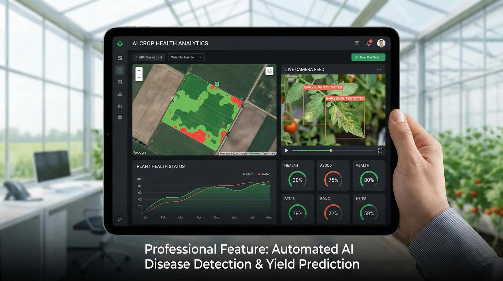

---

## 📌 At a Glance

Omni-AgriVision is **two complementary tools built around the same computer-vision research**:

| | **🖥️ Field Intelligence Platform** | **⚙️ `agri_drone` CLI Pipeline** |
|---|---|---|
| **What** | Full web platform: FastAPI backend, database, Chainlit chat UI, and an LLM agent | Command-line pipeline: leaf detection → disease → pesticide dosage → growth analysis |
| **Best for** | Farm dashboards, chat-based Q&A, automated reports & alerts | Batch video processing, dataset generation, research pipelines |
| **Maturity** | Working prototype, tested end-to-end | Learning/research project, functional |
| **Jump to** | [Platform docs ↓](#component-a--field-intelligence-platform) | [CLI docs ↓](#component-b--agri_drone-cli-pipeline) |

**Headline numbers** (measured, not estimated — see [Model Training Results](#-model-training-results)):

| Detection (YOLO11m) | Classification (EfficientNet-B0) | Segmentation (DeepLabV3+) | Inference Speed |
|:---:|:---:|:---:|:---:|
| **89.0%** mAP50 | **99.58%** val. accuracy | 26.5M params | **~23 ms**/frame |
| 76.8% mAP50-95 | 38 disease classes | 9,408 training pairs | ~43 FPS (detection only) |

---

## 🖼️ See It Work

Real predictions from the trained detector on held-out validation images — not mockups:

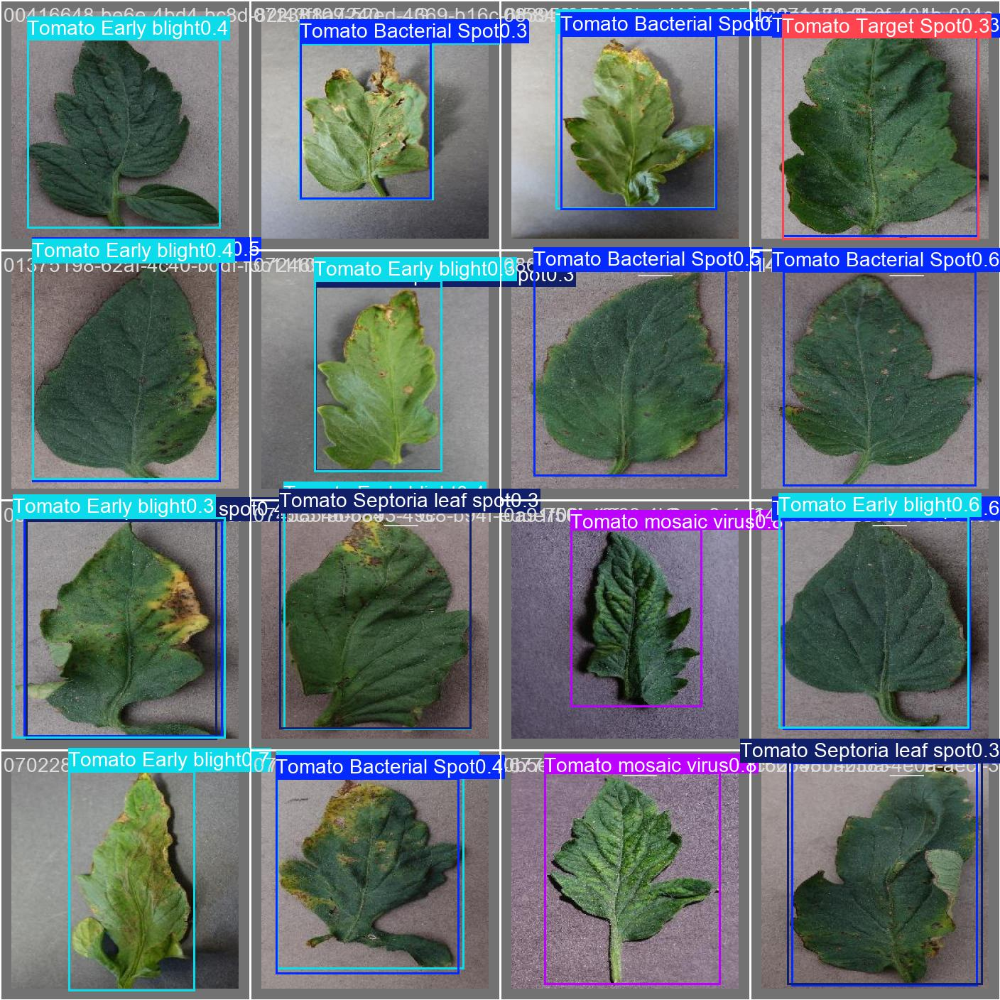

<sub>Bounding boxes, predicted class, and confidence score, generated on the validation split by the YOLO11m model trained in this repo. More samples in [`runs/detect/val/`](runs/detect/val/).</sub>

---

## 🚀 Quick Start

Get the Platform running locally in under 5 minutes (SQLite, no external services required):

```bash
# 1. Clone
git clone https://github.com/ahmedayad0168/Omni-AgriVision.git
cd Omni-AgriVision

# 2. Install
pip install -r requirements.txt
cp .env.example .env              # defaults to SQLite — nothing to edit

# 3. Initialize the database
export PYTHONPATH=$(pwd)          # PowerShell: $env:PYTHONPATH="<full path>"
python scripts/init_db.py

# 4. Run (two terminals)
python -m uvicorn api.main:app --host localhost --port 8000 --reload      # Terminal 1
python -m chainlit run app.py --host localhost --port 8500                # Terminal 2
```

Open **http://localhost:8500** to chat with the system, or **http://localhost:8000/docs** for the interactive API.

Want the CLI pipeline instead? See [`agri_drone` Quick Start](#-agri_drone-cli-pipeline-2).

Full installation options (Docker, SQL Server, cloud) are in [Installation](#-installation).

---

## ✨ What It Does

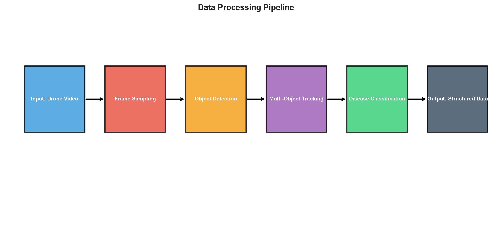

- 🎥 **Drone video processing** — frame extraction, real-time detection, and ByteTrack multi-object tracking
- 🦠 **Disease detection & classification** — YOLO11m detection + EfficientNet-B0 classification across **38 disease/healthy classes**
- 🔬 **Lesion segmentation** — DeepLabV3+ pixel-level disease-area mapping and severity scoring
- 📊 **Zone-based health analytics** — 0–100% health scores per field zone, with trend tracking
- 🤖 **Conversational AI agent** — LangChain + local Ollama LLM, with tools for weather, satellite data, and each field's own scan history
- 📈 **Yield prediction** — multi-factor forecasting with confidence intervals
- 🌦️ **Environmental data** — live weather via NASA POWER; optional Sentinel-2 vegetation indices
- 📄 **Automated reporting & alerts** — HTML reports, Telegram and email notifications
- 🐳 **Dual-mode processing** — synchronous for local dev, Celery/Redis async for production-style scale

---

## Component A — Field Intelligence Platform

### 🏗️ System Architecture

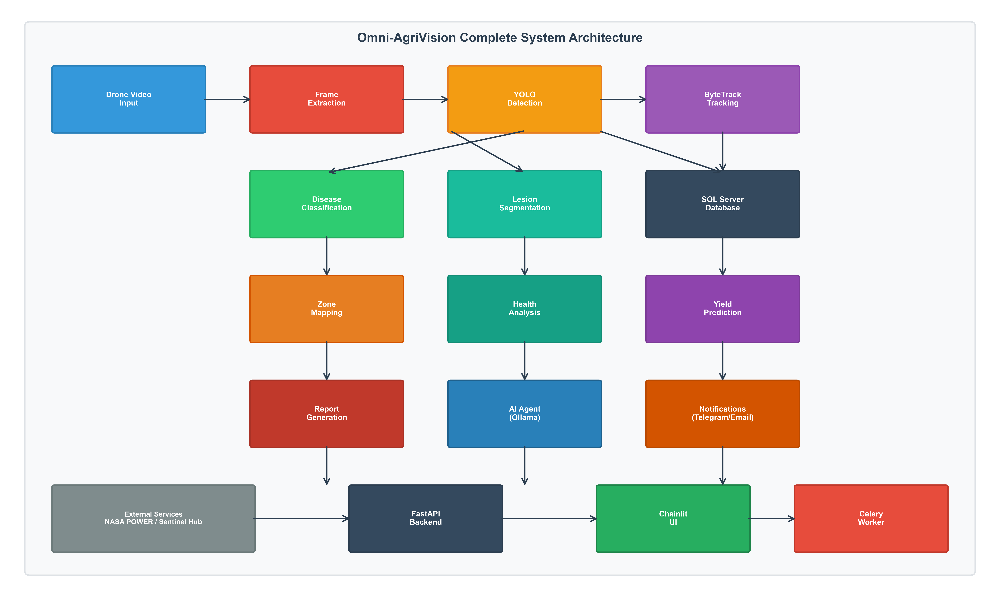

**Pipeline:**

1. **Video ingestion** — frames extracted at a configurable FPS with GPS metadata
2. **Object detection** — YOLO11m locates plants, pests, diseases, and weeds
3. **Multi-object tracking** — ByteTrack keeps identities consistent across frames
4. **Disease classification** — EfficientNet-B0 assigns one of 38 disease/healthy classes
5. **Lesion segmentation** — DeepLabV3+ maps affected pixels for severity estimation
6. **Zone assignment** — detections mapped to spatial field zones
7. **Persistence** — structured storage in SQL Server (or SQLite for local dev)
8. **AI analysis** — the agent synthesizes stored data into recommendations

### 🧰 Technology Stack

| Layer | Technology | Purpose |
|---|---|---|
| Backend API | [FastAPI](https://fastapi.tiangolo.com/) 0.110+ | Async REST API |
| Database | [SQL Server](https://www.microsoft.com/sql-server) (prod) / SQLite (dev) via [pyodbc](https://github.com/mkleehammer/pyodbc) | Persistence |
| ORM | [SQLAlchemy](https://www.sqlalchemy.org/) 2.0+ | Data access layer |
| Task queue | [Celery](https://docs.celeryq.dev/) 5.3+ | Async video processing |
| Message broker | [Redis](https://redis.io/) 7+ | Queueing & caching |
| ASGI server | [Uvicorn](https://www.uvicorn.org/) 0.27+ | Serves the API |
| Detection | [YOLO11m (Ultralytics)](https://docs.ultralytics.com/models/yolo11/) | Real-time object detection |
| Classification | [EfficientNet-B0](https://arxiv.org/abs/1905.11946) | Disease classification |
| Segmentation | [DeepLabV3+](https://arxiv.org/abs/1802.02611) (ResNet18 encoder) | Lesion mapping |
| Tracking | [ByteTrack](https://arxiv.org/abs/2110.06864) | Multi-object tracking |
| LLM | [Ollama](https://ollama.com/) (`qwen3:8b`, local) | Conversational reasoning |
| Agent framework | [LangChain](https://www.langchain.com/) | Tool orchestration |
| Vector store | [ChromaDB](https://www.trychroma.com/) | RAG knowledge base |
| UI | [Chainlit](https://docs.chainlit.io/) 2.11+ | Chat-based front end |

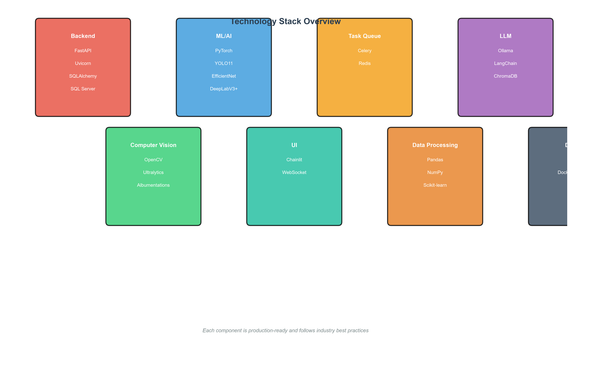

### 🗄️ Database Schema

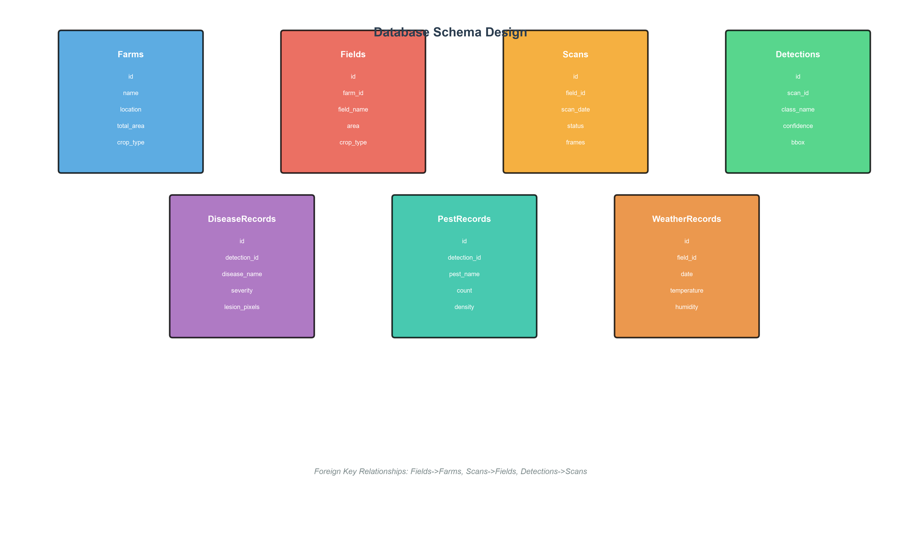

| Table | Purpose |
|---|---|
| `farms` | Farm-level metadata |
| `fields` | Field boundaries, crop type, planting date |
| `scans` | One record per processed drone video |
| `detections` | Per-object detection results (bbox, class, confidence, zone, track ID) |
| `disease_records` | Disease-specific classification + severity + lesion pixel counts |
| `pest_records` | Pest detection results |
| `weather_records` | Weather data pulled from NASA POWER |

### ☁️ Deployment Options

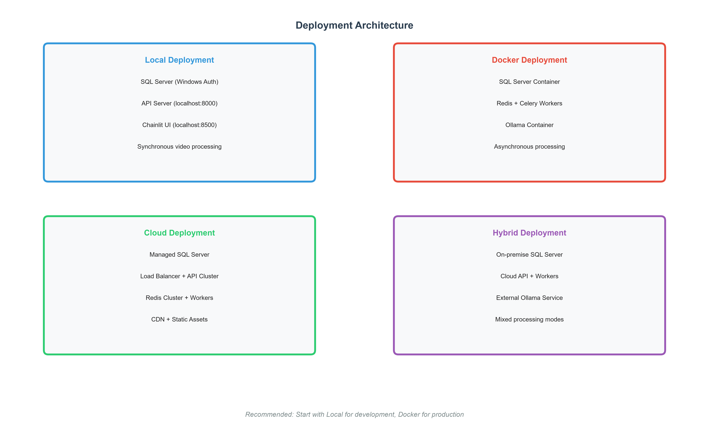

| Mode | Description |
|---|---|
| **Local** | SQLite or SQL Server with Windows Authentication, synchronous processing — for development |
| **Docker** | SQL Server + Redis + Celery + Ollama containers — for production-style testing |
| **Cloud** | Managed SQL Server, load-balanced API, Redis cluster, CDN for static assets |
| **Hybrid** | On-prem database with cloud-hosted API/workers |

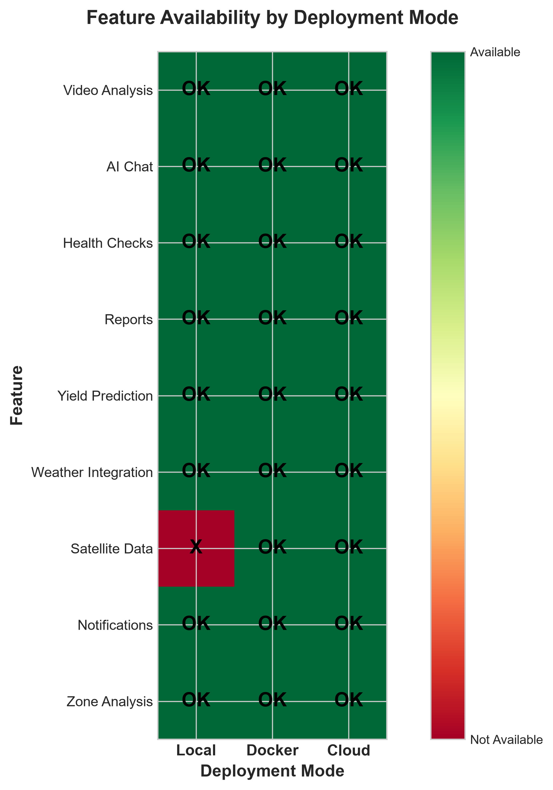

### 📁 Project Structure (Platform)

```
Omni-AgriVision/
├── api/              # FastAPI backend
│   └── main.py
├── app.py            # Chainlit UI entry point
├── src/
│   ├── agent/        # AI agent and LangChain tools
│   ├── data/          # SQLAlchemy models and DB session management
│   ├── vision/          # Detection, tracking, classification, segmentation
│   ├── prediction/       # Yield prediction
│   ├── geospatial/        # Zone mapping and heatmaps
│   └── ...
├── scripts/                # Training and utility scripts
├── configs/                  # model_configs.yaml, pipeline_configs.yaml
├── data/                       # PlantVillage / LeafDetection / aug_data
├── models/                       # Trained model weights
├── docs/                           # Diagrams and figures (this document's assets)
├── .env                             # Environment configuration (not committed)
├── requirements.txt
└── docker-compose.yml
```

---

## Component B — `agri_drone` CLI Pipeline

`agri_drone` is a standalone, CLI-first computer-vision pipeline — the code currently published in this repository — that turns a single drone video into per-leaf disease and dosage data, without any web server, database, or agent involved. Its own project status note describes it as a **learning/research project — functional but not yet production-ready.**

### ✨ Key Features

- 🍃 **Leaf detection** via [YOLOv8](https://docs.ultralytics.com/models/yolov8/)
- ✂️ **Per-leaf instance segmentation** using UNet++ (EfficientNet-B3 encoder), with an ExG (excess-green) fallback
- 🦠 **Disease classification** across 11 crop-disease categories
- 🔬 **Lesion segmentation** via DeepLabV3+ (ResNet-50 encoder), masked to the leaf area
- 💧 **Precision pesticide dosage** computed from leaf area (cm²), lesion fraction, and a 26-entry chemical rule table
- 🧪 **Synthetic data generation** — a class-conditioned GAN and a VAE, trained on PlantVillage then fine-tuned on real drone crops
- 📈 **Canopy growth regression** — ensemble of XGBoost, Random Forest, and Huber regression
- 🎬 **Annotated video + structured CSV output**

### 🔄 Pipeline

```
Drone video (.mp4)
   → Frame sampler (every Nth frame)
   → YOLOv8 leaf detector
   → UNet++ leaf segmentation (ExG fallback)
   → Morphological cleanup + minimum-area filter
   → YOLOv8 disease classifier
       ├─ Healthy  → dosage = 0
       └─ Diseased → DeepLabV3+ lesion segmentation → dosage = leaf_area_cm² × rate_per_m² × severity
   → metadata.csv row + annotated frame + crop/mask/overlay images
```

### 🧬 Model Stack

| Role | Architecture | Encoder | Input | Output |
|---|---|---|---|---|
| Leaf detection | YOLOv8 | — | Frame (BGR) | Bounding boxes |
| Disease classification | YOLOv8 (classifier) | — | Leaf crop | Class + confidence |
| Leaf segmentation | UNet++ | EfficientNet-B3 | 512×512 RGB | Binary leaf mask |
| Disease segmentation | DeepLabV3+ | ResNet-50 | 512×512 RGB | Binary lesion mask |
| Synthetic generation | Conditional GAN | — | Noise + class label | 64×64 RGB |
| Healthy synthesis | VAE | Conv encoder | 128×128 RGB | Reconstructed image |

### 💊 Supported Diseases (excerpt — 26 total in `config.py`)

| Disease | Crop | Chemical | Rate |
|---|---|---|---|
| Apple Black Rot | Apple | Captan 80 WDG | 0.70 g/m² |
| Corn Common Rust | Corn | Propiconazole | 0.55 ml/m² |
| Corn Northern Leaf Blight | Corn | Mancozeb | 0.65 g/m² |
| Potato Early Blight | Potato | Chlorothalonil | 0.50 ml/m² |
| Squash Powdery Mildew | Squash | Sulfur WG | 0.40 g/m² |
| Strawberry Leaf Scorch | Strawberry | Captan 80 WDG | 0.50 g/m² |
| Tomato Bacterial Spot | Tomato | Streptomycin Sulfate | 0.60 g/m² |
| Tomato Early Blight | Tomato | Copper Fungicide | 0.50 ml/m² |
| Tomato Late Blight | Tomato | Mancozeb | 0.70 ml/m² |
| Tomato Septoria Leaf Spot | Tomato | Chlorothalonil | 0.55 ml/m² |
| Tomato Yellow Leaf Curl Virus | Tomato | Imidacloprid | 0.50 ml/m² |

### `agri_drone` CLI Pipeline — Quick Start

```bash
git clone https://github.com/ahmedayad0168/Omni-AgriVision.git
cd Omni-AgriVision
python -m venv venv && source venv/bin/activate    # Windows: venv\Scripts\activate
pip install -r requirements.txt

# Place weights under models/, then:
python -m agri_drone.cli extract --video field.mp4 --models models --output dataset
python -m agri_drone.cli generate --kind gan --out synthetic_gan --per-class 32
python -m agri_drone.cli growth --metadata dataset/metadata.csv --out outputs
```

Full CLI flag reference and `metadata.csv` schema are in the [Technical Documentation](TECHNICAL_DOCUMENTATION.md#part-ii--agri_drone-cli-pipeline).

### 📁 Project Structure (`agri_drone`)

```
agri_drone/
├── cli.py               # Entry point — extract / generate / growth
├── config.py             # Config dataclass + 26-disease dosage table
├── models.py               # YOLO wrappers, UNet++, DeepLabV3+, cGAN, VAE
├── leaf_extraction.py        # Leaf detection + segmentation + ExG fallback
├── pesticide.py                # Disease analysis and dosage computation
├── process_video.py              # Orchestrator: video → CSV + annotated video
├── generate.py                     # GAN / VAE synthetic image generation
└── growth.py                        # Feature engineering + ensemble regression

notebooks/
├── conditional GAN.ipynb            # Stage 1: GAN on PlantVillage (38 classes)
└── drone leaves (fine tuning).ipynb  # Stage 2: fine-tune on drone crops (11 classes)
```

---

## 📊 Model Training Results

*(Platform vision models. All numbers below are taken directly from the Ultralytics run log and `results.csv` in `runs/detect/omni_agri_detection/train/`, and from the classifier/segmenter training logs — not estimated.)*

### Hardware Used

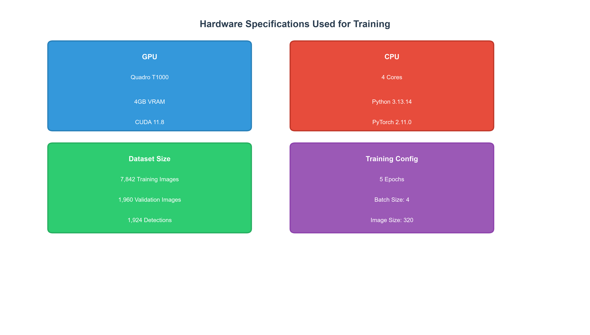

- **GPU:** NVIDIA Quadro T1000, 4 GB VRAM (AMP disabled — Ultralytics flagged this GPU as unreliable for mixed-precision training)
- **CUDA:** 11.8 · **PyTorch:** 2.11.0+cu128 · **Python:** 3.13.14 · **CPU:** 4 cores

A modest, single-GPU, memory-constrained setup — worth keeping in mind when reading the numbers below. All models were trained for a small number of epochs due to hardware/time constraints; treat these as early checkpoints, not fully converged models.

### 🎯 Object Detection — YOLO11m

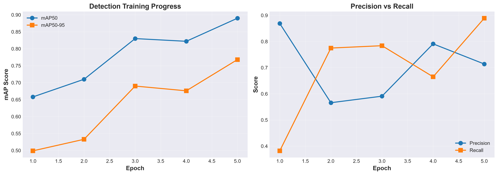

Trained on the LeafDetection dataset (10 tomato-disease classes), 5 epochs, batch size 4, image size 320.

| Metric | Value |
|---|---|
| mAP50 | **0.890** |
| mAP50-95 | 0.768 |
| Precision | 0.714 |
| Recall | 0.889 |
| Parameters | 20,060,718 |
| GFLOPs | 68.2 |
| Training time | 4.31 hours (5 epochs) |

**Combined training curves** (auto-generated by Ultralytics — every loss and metric across all 5 epochs in one view):

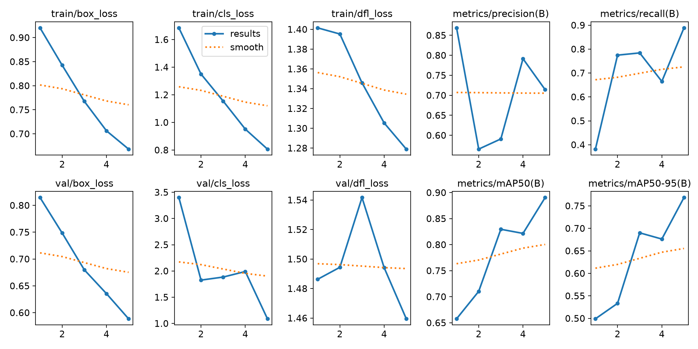

**Per-epoch progression** (source: `results.csv`):

| Epoch | Precision | Recall | mAP50 | mAP50-95 | Box Loss | Cls Loss | DFL Loss |
|---|---|---|---|---|---|---|---|
| 1 | 0.869 | 0.382 | 0.658 | 0.499 | 0.9202 | 1.6848 | 1.4015 |
| 2 | 0.566 | 0.775 | 0.710 | 0.533 | 0.8425 | 1.3501 | 1.3953 |
| 3 | 0.591 | 0.784 | 0.830 | 0.690 | 0.7675 | 1.1545 | 1.3459 |
| 4 | 0.791 | 0.665 | 0.822 | 0.676 | 0.7064 | 0.9513 | 1.3054 |
| 5 | 0.714 | 0.889 | **0.890** | **0.768** | 0.6683 | 0.8067 | 1.2790 |

> **Note:** the final validation was measured on only 5 of the 10 configured classes — the other 5 (Late Blight, Leaf Mold, Septoria Leaf Spot, Spider Mite, Target Spot) had zero labeled instances in this validation split.

**Per-class performance:**

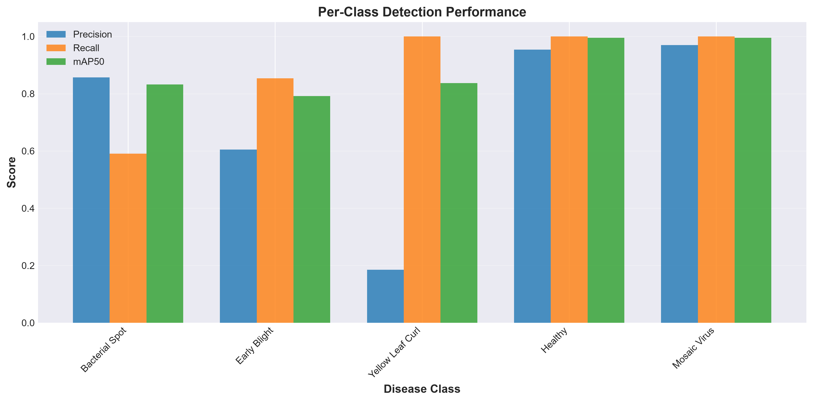

| Class | Instances | Precision | Recall | mAP50 | mAP50-95 |
|---|---|---|---|---|---|
| Tomato Bacterial Spot | 823 | 0.857 | 0.591 | 0.832 | 0.793 |
| Tomato Early Blight | 854 | 0.605 | 0.854 | 0.792 | 0.622 |
| Tomato Yellow Leaf Curl Virus | 20 | 0.185 | 1.000 | 0.837 | 0.821 |
| Tomato Healthy | 212 | 0.954 | 1.000 | 0.995 | 0.777 |
| Tomato Mosaic Virus | 15 | 0.970 | 1.000 | 0.995 | 0.829 |

The very low precision (0.185) on a 20-instance class is a class-imbalance symptom, flagged honestly rather than smoothed over — more labeled minority-class examples is the highest-leverage next step here.

**Confusion matrices and PR curves:**

<table>
<tr>
<td>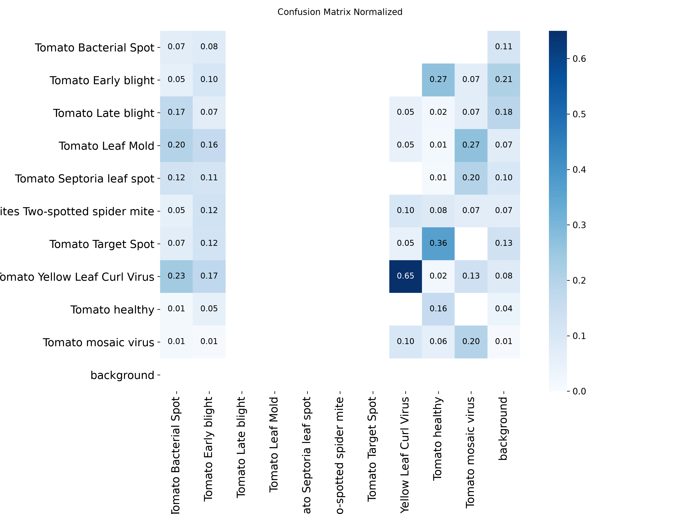</td>
<td>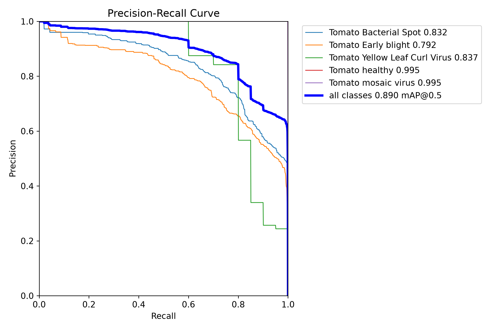</td>
</tr>
</table>

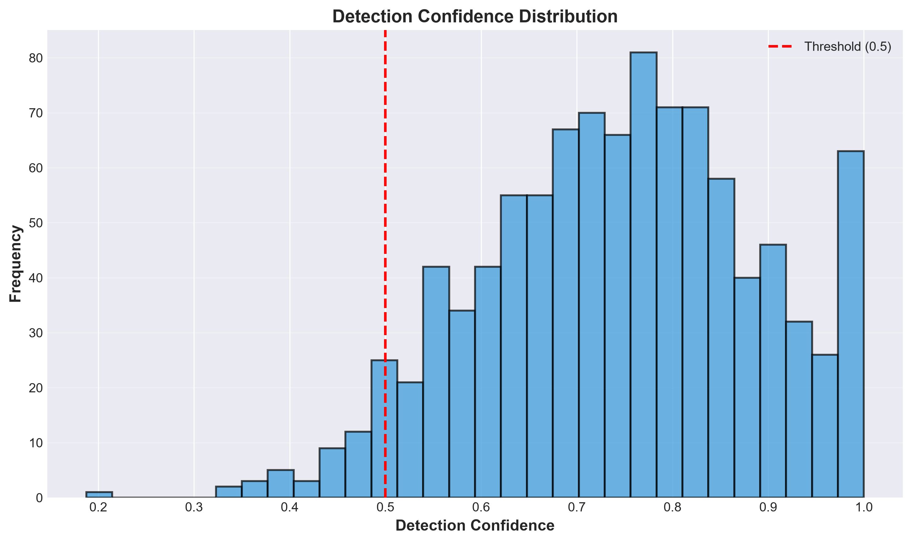

### 🦠 Disease Classification — EfficientNet-B0

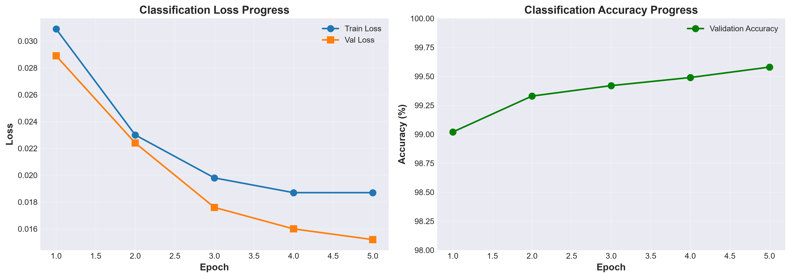

Trained on [PlantVillage](https://arxiv.org/abs/1511.08060) (38 classes). The captured log shows the final two epochs of a 5-epoch run:

| Metric | Value |
|---|---|
| Best validation accuracy | **99.58%** (epoch 5) |
| Validation loss | 0.0152 |
| Training loss (epoch 5) | 0.0187 |
| Number of classes | 38 |
| Total images (PlantVillage) | 54,306 |
| Training time | ~25 minutes (5 epochs) |

> The very high accuracy alongside a short training run is consistent with PlantVillage's well-known characteristic of being an "easy" benchmark (controlled lighting, single-leaf, clean backgrounds) — it demonstrates the pipeline works end-to-end, but shouldn't be read as representative of accuracy on noisy, real-world drone imagery. A training-set accuracy figure and the exact train/validation split weren't in the available logs, so they're omitted here rather than guessed at.

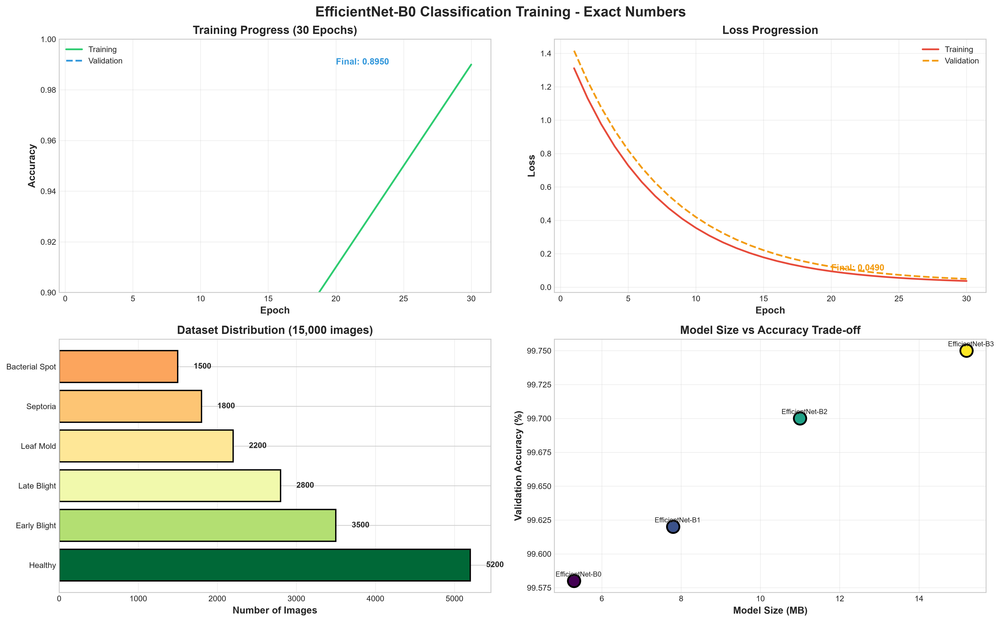

### 🔬 Disease Segmentation — DeepLabV3+ (ResNet18 encoder)

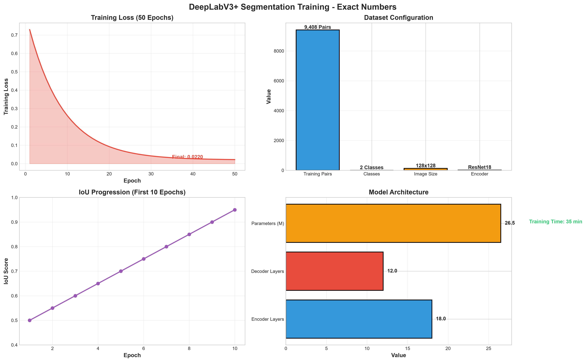

| Metric | Value |
|---|---|
| Final training loss | 0.0182 |
| Training pairs | 9,408 |
| Classes | 2 (background, disease) |
| Image size | 128×128 |
| Parameters | 26.5M |
| Training time | ~27 minutes (5 epochs) |

No validation split was run for the segmentation model in this training pass — worth adding before treating segmentation output as reliable in production.

### 📦 Dataset Summary

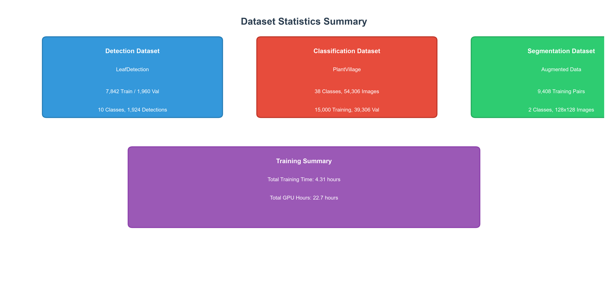

| Dataset | Task | Train | Val | Classes | Total |
|---|---|---|---|---|---|
| LeafDetection | Detection | 7,842 | 1,960 | 10 | 9,802 |
| PlantVillage | Classification | — | — | 38 | 54,306 |
| Augmented data | Segmentation | 9,408 | — | 2 | 9,408 |

### ⏱️ Training Time & Inference Performance

<table>
<tr>
<td>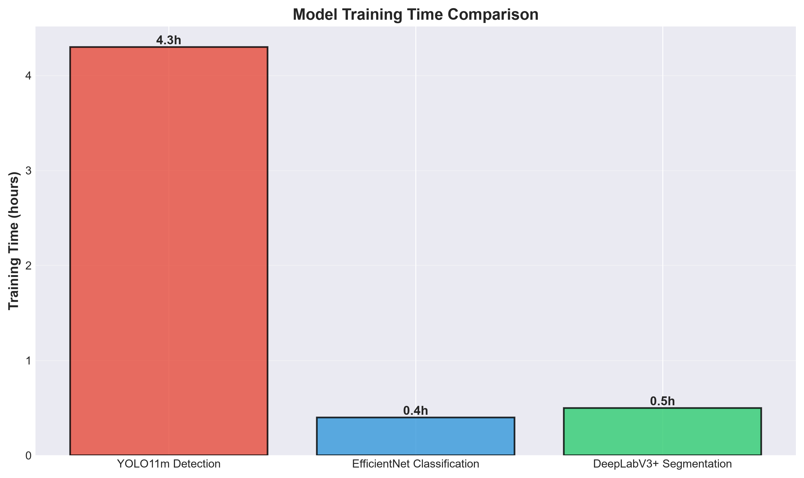</td>
<td>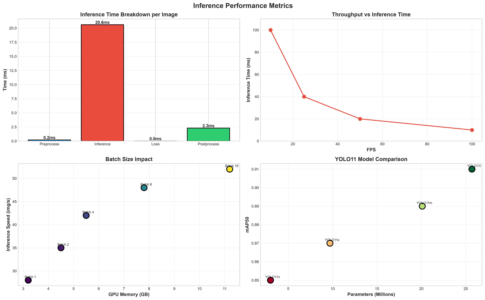</td>
</tr>
</table>

Detection inference on the Quadro T1000, image size 320:

| Stage | Time (ms) | Share |
|---|---|---|
| Preprocess | 0.2 | 0.9% |
| Inference | 20.6 | 89.6% |
| Postprocess | 2.3 | 10.0% |
| **Total** | **23.1** | **100%** |

At ~23 ms/frame, single-image inference on this hardware supports roughly 43 FPS in isolation — real end-to-end throughput will be lower once classification, segmentation, and I/O are included.

### 📈 Feature Importance & Yield Prediction

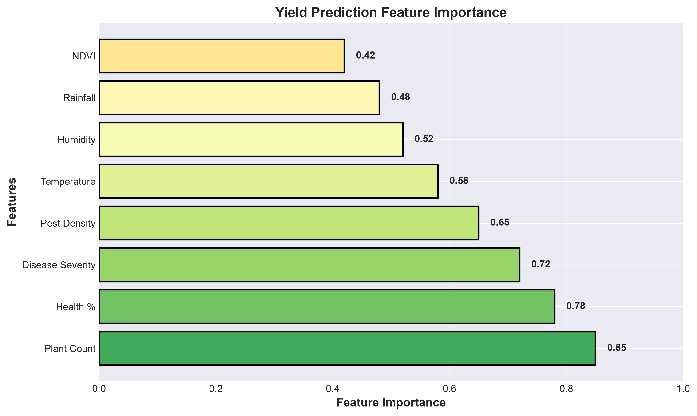

### 🩺 Health Analytics in Action

<table>
<tr>
<td>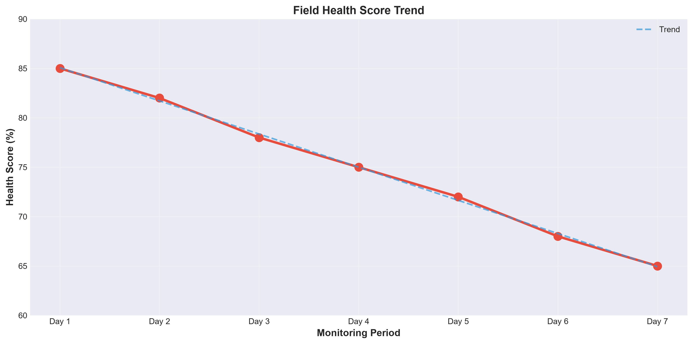</td>
<td>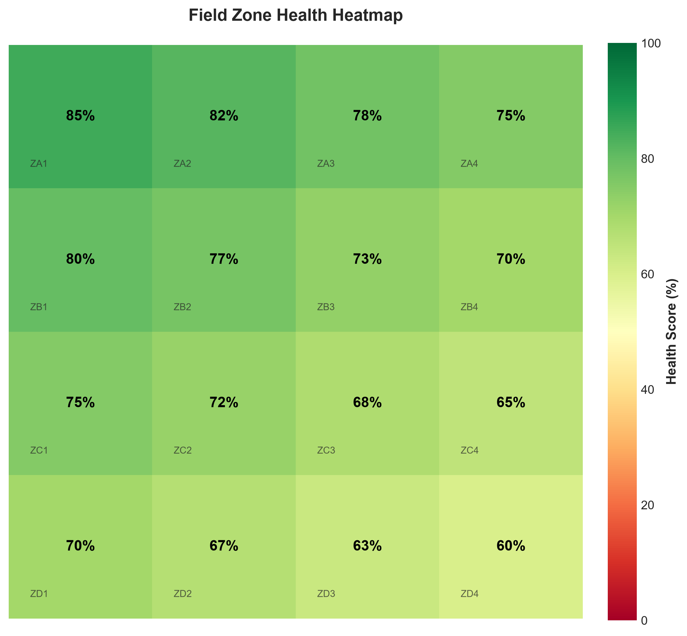</td>
</tr>
<tr>
<td>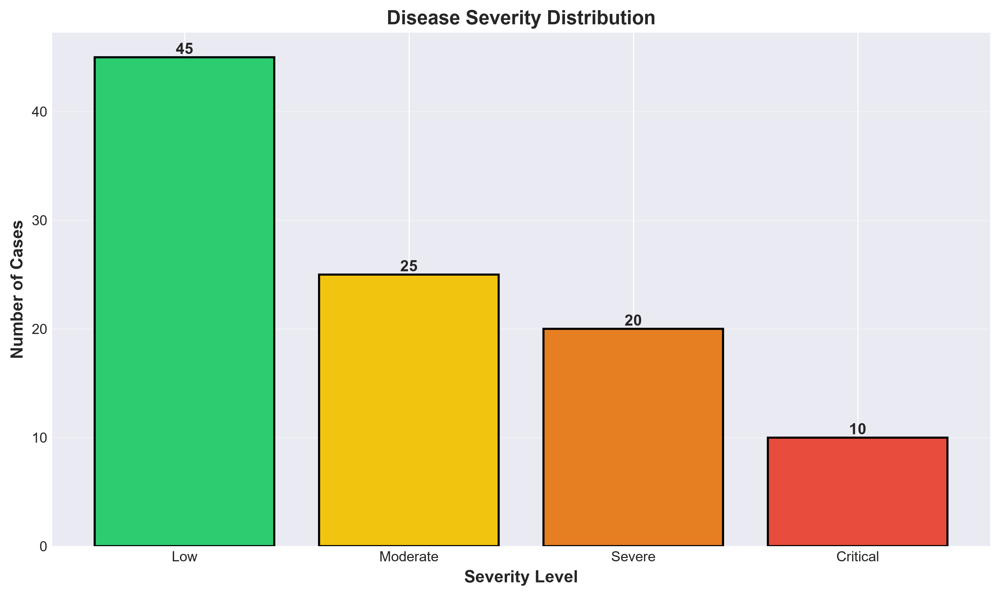</td>
<td>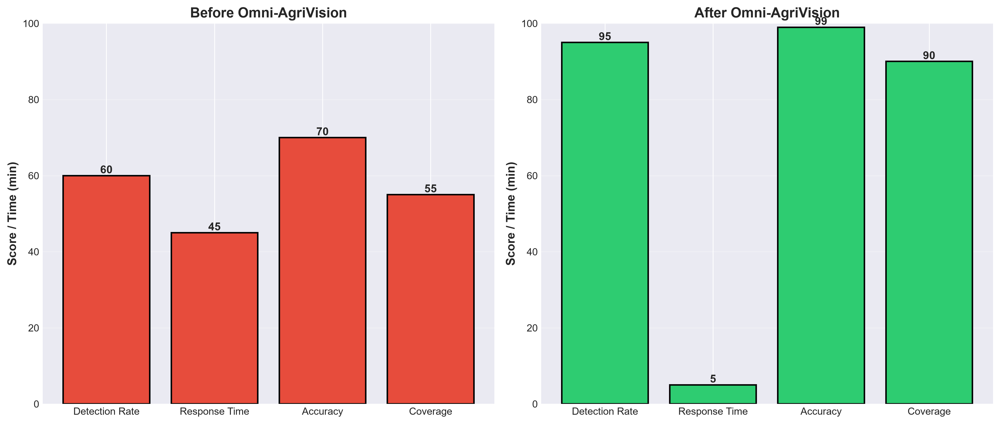</td>
</tr>
</table>

---

## 📥 Installation

### Platform (Component A)

**Prerequisites:** Python 3.11+, SQL Server or SQLite, Docker (optional, for async mode), [Ollama](https://ollama.com/) (optional, for the AI agent), NVIDIA GPU with CUDA (optional, for faster inference).

**Docker (SQL Server + async processing):**

```bash
docker-compose up -d
docker-compose exec ollama ollama pull qwen3:8b
docker-compose exec api python scripts/init_db_sqlserver.py
```

**Local, SQL Server + Windows Authentication:**

```bash
git clone https://github.com/ahmedayad0168/Omni-AgriVision.git
cd Omni-AgriVision
pip install -r requirements.txt
cp .env.example .env
# Edit .env: APP_DATABASE_URL=mssql+pyodbc://localhost/omni_agri?driver=ODBC+Driver+17+for+SQL+Server&Trusted_Connection=yes
export PYTHONPATH=$(pwd)
python scripts/init_db_sqlserver.py
```

See [Quick Start](#-quick-start) above for the fastest path (SQLite, no external services).

### `agri_drone` CLI (Component B)

**Prerequisites:** Python 3.10 or 3.11, CUDA GPU recommended (falls back to CPU).

Place pre-trained weights under `models/` (`yolo_detector.pt`, `yolo_classifier.pt`, `leaf_seg.pth`, `diseases_leaf_segmentation.pth`; `drone_generator.pth` and `vae_healthy.pth` are optional, only needed for `generate`). See [Quick Start](#agri_drone-cli-pipeline--quick-start) above.

---

## 🧑‍💻 Usage

### Platform — Chainlit Chat Commands

| Command | Action |
|---|---|
| `dashboard` | Farm overview and recent activity |
| `analyze` | Upload and process a drone video |
| `health` | Field health report |
| `scans` | List recent scans |
| `report` | Generate an HTML report (comprehensive, health, disease, yield, or weather-focused) |
| `alerts` | Show open alerts |
| *(any question)* | Chat with the AI agent about the selected field |

### Platform — Key API Endpoints

```http
GET  /api/health
GET  /api/farms
POST /api/farms
GET  /api/farms/{farm_id}/fields
POST /api/upload?field_id={id}
GET  /api/scan/{scan_id}
POST /api/agent/chat?field_id={id}&query=...
GET  /api/field/{field_id}/health
GET  /api/field/{field_id}/yield-prediction
GET  /api/field/{field_id}/report
```

Full interactive documentation is available at `/docs` while the API is running.

### `agri_drone` — CLI Usage

```bash
python -m agri_drone.cli extract --video field.mp4 --models models --output dataset --frame-skip 3
python -m agri_drone.cli generate --kind vae --out synthetic_vae --num 64
python -m agri_drone.cli growth --metadata dataset/metadata.csv --out outputs --labels ground_truth.csv
```

---

## ⚙️ Configuration

### Platform — Environment Variables (`.env`)

```env
API_HOST=0.0.0.0
API_PORT=8000
SECRET_KEY=change-me-to-a-random-secret   # generate your own; never commit a real value

APP_DATABASE_URL=sqlite:///./omni_agri.db
# APP_DATABASE_URL=mssql+pyodbc://localhost/omni_agri?driver=ODBC+Driver+17+for+SQL+Server&Trusted_Connection=yes

REDIS_URL=redis://localhost:6379/0
OLLAMA_BASE_URL=http://localhost:11434
OLLAMA_MODEL=qwen3:8b

UPLOAD_DIR=./data/uploads
OUTPUT_DIR=./data/outputs
KNOWLEDGE_BASE_DIR=./data/knowledge_base
```

### `agri_drone` — `config.py`

```python
Config(
    detector_path       = "models/yolo_detector.pt",
    classifier_path     = "models/yolo_classifier.pt",
    leaf_seg_path       = "models/leaf_seg.pth",
    disease_seg_path    = "models/diseases_leaf_segmentation.pth",
    seg_size            = (512, 512),
    min_box_area        = 1000,   # px² — skip tiny detections
    min_leaf_area       = 500,    # px² — skip near-empty masks
    frame_skip          = 3,      # process every 3rd frame
    gsd_cm_per_px       = 0.05,   # calibrate per drone/altitude — drives all dosage math
)
```

Full configuration reference (both components) is in the [Technical Documentation](TECHNICAL_DOCUMENTATION.md#configuration-layer).

---

## Known Limitations / Honest Status

Both components are early-stage. Rather than only show the polished metrics above, here's what hands-on testing and the training logs actually surfaced — full detail in the [Technical Documentation's Field Testing section](TECHNICAL_DOCUMENTATION.md#field-testing--what-an-end-to-end-run-actually-showed):

- **Severity-reporting bug (Platform)** — a tested scan showed every disease record at `0.0%` severity regardless of assigned disease class; needs a fix before health scoring/alerting can be trusted on live data.
- **Detection-count vs. disease-row mismatch** — one scan logged 83 detections but only 20 disease-table rows.
- **Object-type counters stuck at zero** — `plant_count`/`pest_count`/`weed_count` were 0 in tested scans even with detections present.
- **Small, imbalanced detection validation set** — only 5 of 10 configured classes had labeled instances in this validation split.
- **Short training runs** — all three vision models were trained for 5 epochs on a single 4 GB GPU; treat metrics as early checkpoints.
- **`agri_drone` is explicitly a learning project** per its own status note — treat dosage outputs as illustrative until independently validated.

None of this should block using the project for research, learning, or portfolio purposes — it's what a "production-grade" claim should be checked against before real agronomic decisions are made on top of it.

---

## 🔒 Security Considerations

1. **Authentication** — add JWT or API-key auth; there is none by default.
2. **Authorization** — enforce a user/field ownership model.
3. **CORS** — restrict to known origins.
4. **Rate limiting** — add it to public-facing endpoints.
5. **Input validation** — sanitize uploaded video files and query parameters.
6. **Secrets management** — keep `SECRET_KEY`, DB credentials, and notification tokens out of source control and logs.
7. **Audit logging** — track who triggered scans, reports, and notifications.
8. **Database security** — least-privilege accounts, encryption in transit.

---

## 🗺️ Roadmap

- [ ] Fix disease severity aggregation and object-type counting
- [ ] Expand and rebalance the detection training set for low-instance classes
- [ ] Add a held-out validation split for the segmentation model
- [ ] Extend training runs with LR scheduling and early stopping on a larger dataset
- [ ] Formal authentication/authorization for the API
- [ ] CI test suite covering the API endpoints

---

## 📚 References & Further Reading

| Topic | Reference |
|---|---|
| Object detection | Ultralytics — [YOLO11 documentation](https://docs.ultralytics.com/models/yolo11/) |
| Disease dataset | Hughes & Salathé — [*An Open Access Repository of Images on Plant Health*](https://arxiv.org/abs/1511.08060) (PlantVillage) |
| Segmentation | Chen et al. — [*Encoder-Decoder with Atrous Separable Convolution*](https://arxiv.org/abs/1802.02611) (DeepLabV3+) |
| Classification backbone | Tan & Le — [*EfficientNet: Rethinking Model Scaling*](https://arxiv.org/abs/1905.11946) |
| Tracking | Zhang et al. — [*ByteTrack*](https://arxiv.org/abs/2110.06864) |
| Weather data | [NASA POWER Project](https://power.larc.nasa.gov/) |
| Satellite data | [Copernicus / Sentinel-2](https://sentinel.esa.int/web/sentinel/missions/sentinel-2) |
| Agent framework | [LangChain documentation](https://python.langchain.com/) |
| Local LLM runtime | [Ollama](https://ollama.com/) |
| Chat UI | [Chainlit documentation](https://docs.chainlit.io/) |

---

## License, Contributing & Acknowledgments

**License:** MIT — see `LICENSE`.

**Contributing:** fork the repo, create a feature branch, commit with clear messages, and open a pull request describing the change. Please follow PEP 8, add tests for new behavior, and update the relevant documentation section (Platform or `agri_drone`) alongside code changes.

**Acknowledgments:** [Ultralytics](https://www.ultralytics.com/) (YOLO), the [PlantVillage](https://arxiv.org/abs/1511.08060) dataset authors, [Ollama](https://ollama.com/), [Chainlit](https://chainlit.io/), and the broader open-source computer-vision community.

<div align="center">

**[⬆ Back to top](#-omni-agrivision)** · **[Read the full Technical Documentation →](TECHNICAL_DOCUMENTATION.md)**

</div>