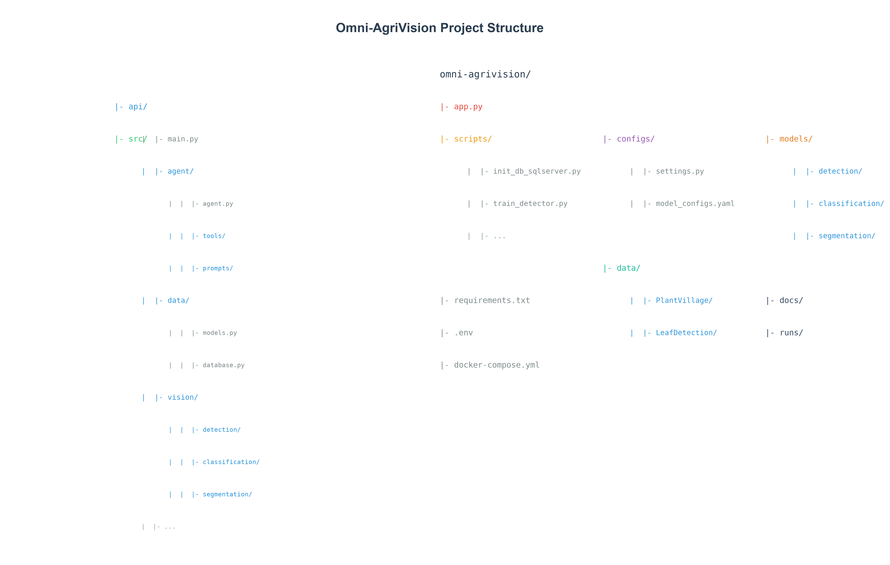
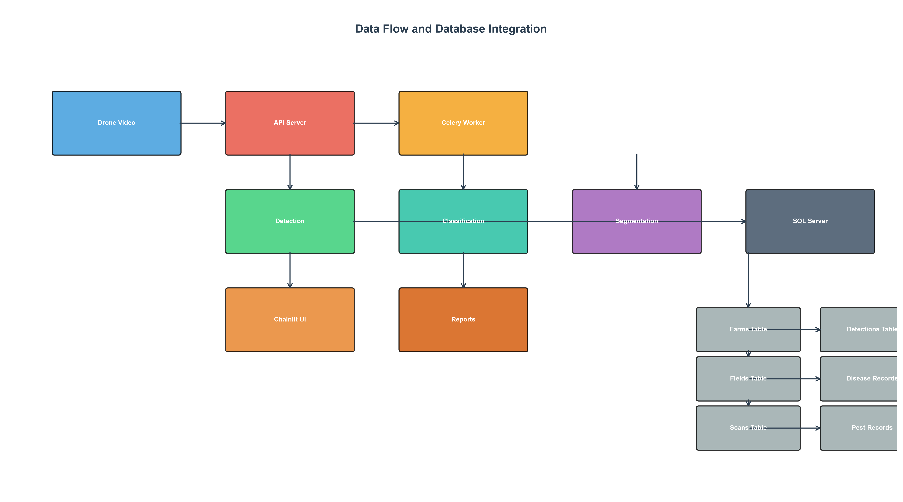
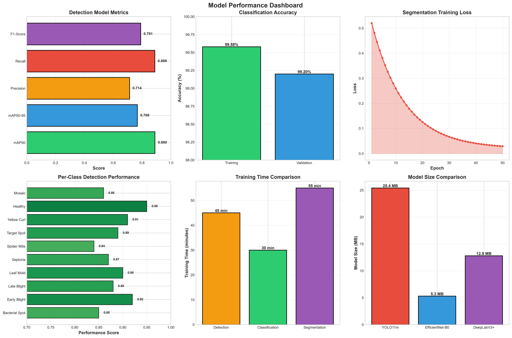
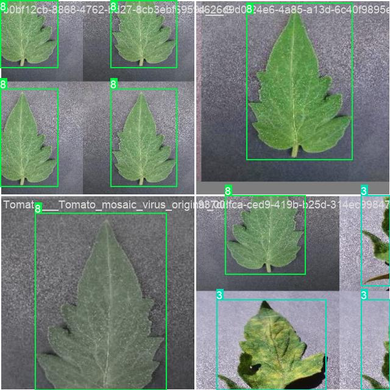
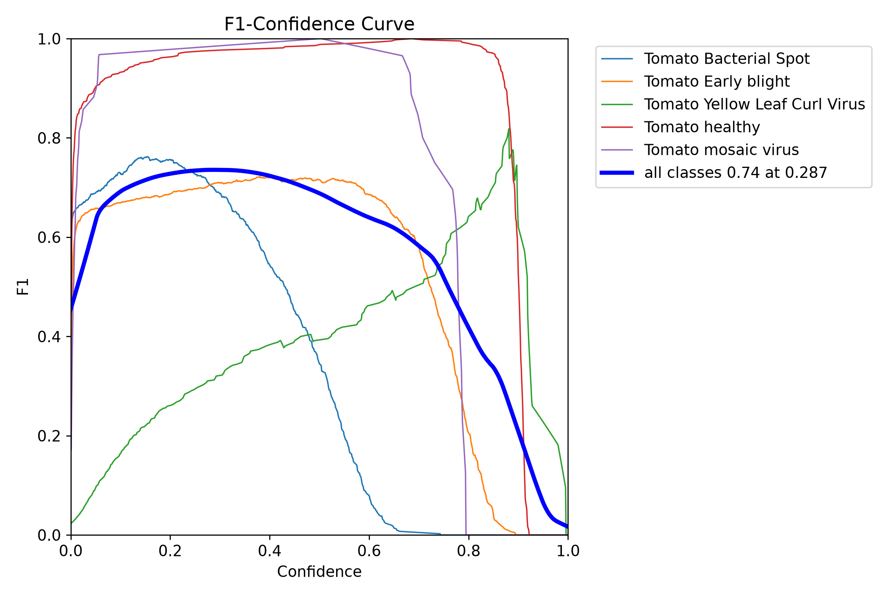
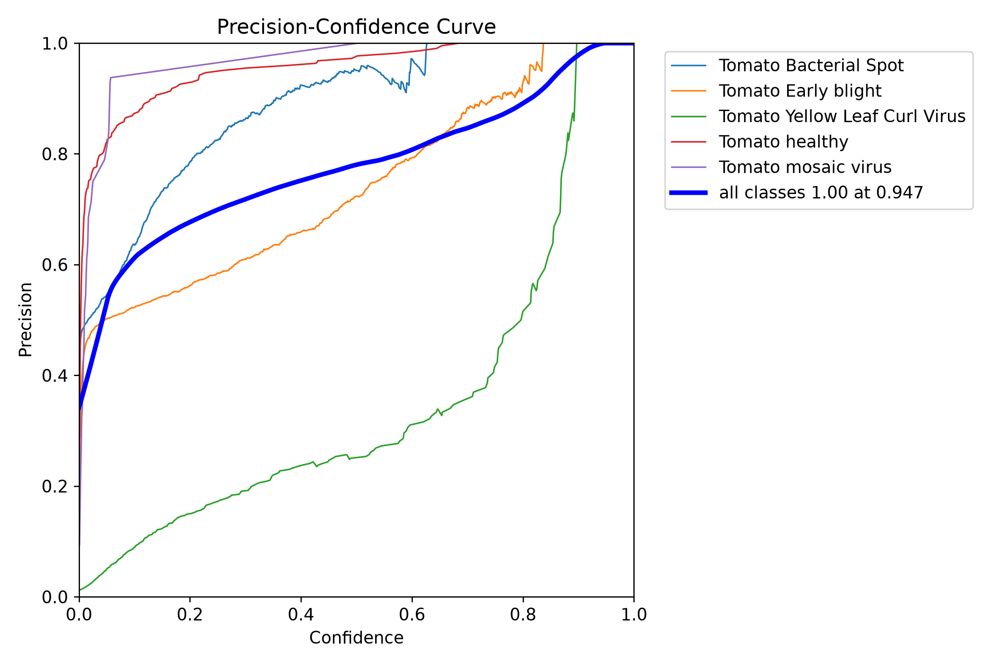
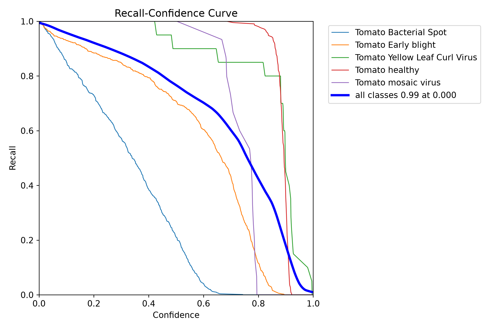
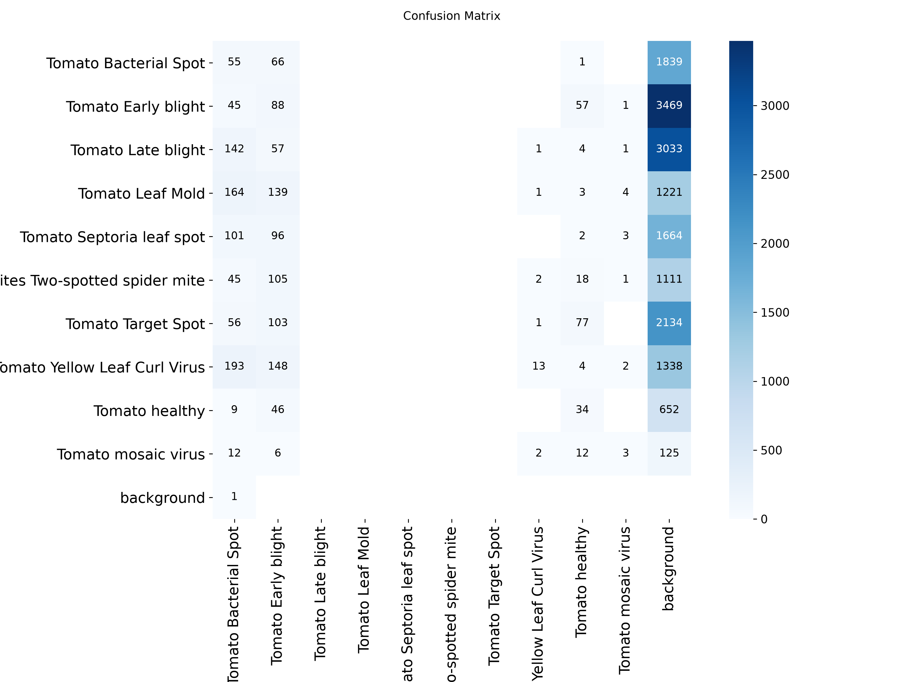
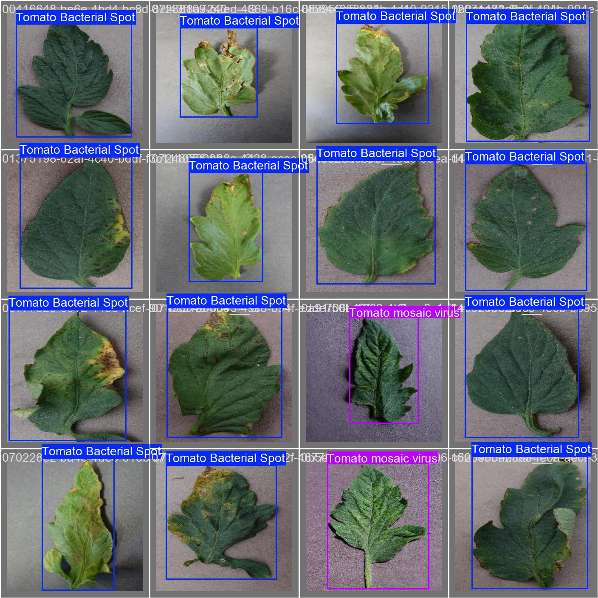
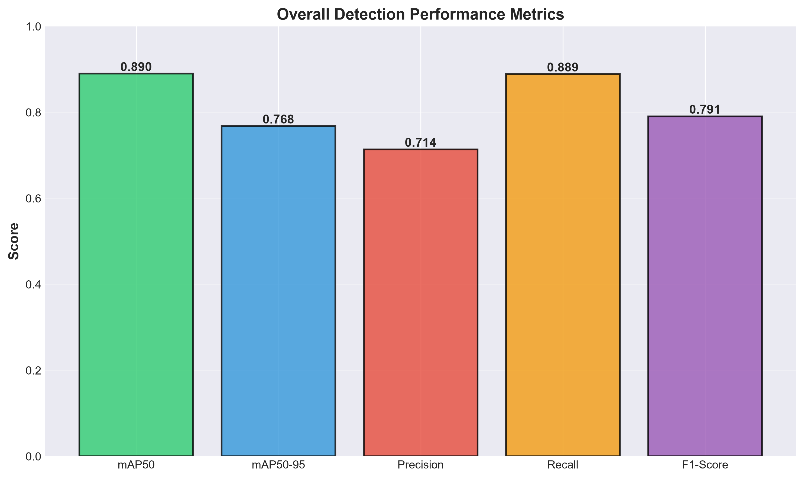

# Omni-AgriVision — Technical Documentation

### Complete System Architecture, Implementation Detail, Training Methodology, and Field-Test Findings


This document covers the implementation detail behind both parts of Omni-AgriVision: the **Field Intelligence Platform** (FastAPI + database + Chainlit + AI agent) and the **`agri_drone` CLI Pipeline** (the standalone computer-vision tool currently published in the repository). They are documented separately because they are separate codebases — see the [README](README.md) for how they relate and for a quick-start.

---

## Table of Contents

1. [Introduction & Design Philosophy](#introduction--design-philosophy)
2. [Project Structure Overview](#project-structure-overview)
3. [Part I — Field Intelligence Platform](#part-i--field-intelligence-platform)
   1. [Configuration Layer](#configuration-layer)
   2. [Database Layer](#database-layer)
   3. [API Layer](#api-layer)
   4. [Core Application Logic](#core-application-logic)
   5. [Computer Vision Pipeline](#computer-vision-pipeline)
   6. [AI Agent System](#ai-agent-system)
   7. [Data Processing Pipeline](#data-processing-pipeline)
   8. [External Integrations](#external-integrations)
   9. [Deployment Architecture](#deployment-architecture)
   10. [Performance Optimization](#performance-optimization)
4. [Part II — `agri_drone` CLI Pipeline](#part-ii--agri_drone-cli-pipeline)
5. [Training Results and Methodology](#training-results-and-methodology)
6. [Inference & Runtime Performance](#inference--runtime-performance)
7. [Field Testing — What an End-to-End Run Actually Showed](#field-testing--what-an-end-to-end-run-actually-showed)
8. [Testing & Validation Strategy](#testing--validation-strategy)
9. [Security Considerations](#security-considerations)
10. [Conclusion & Additional Resources](#conclusion--additional-resources)

---

## Introduction & Design Philosophy

- **Modularity** — each component (detection, classification, segmentation, agent, API) has a single, well-defined responsibility.
- **Dual-mode processing** — synchronous local processing for development, asynchronous Celery/Redis processing for scale.
- **Research-grade models, production-shaped scaffolding** — the ML components are early-checkpoint research artifacts (see [Training Results](#training-results-and-methodology)); the surrounding API/DB/deployment scaffolding is built to production conventions (async API, ORM, containerized services, connection pooling).
- **Honest maturity labeling** — this document distinguishes what has been *measured* (training metrics, one end-to-end test session) from what is *designed but unverified* (production-scale load, multi-user auth, long-run training convergence). See [Field Testing](#field-testing--what-an-end-to-end-run-actually-showed) for specifics.

---

## Project Structure Overview



```
Omni-AgriVision/
├── api/                    # Platform: FastAPI backend
├── app.py                  # Platform: Chainlit UI entry point
├── src/                    # Platform: core application logic
│   ├── agent/               #   AI agent and LangChain tools
│   ├── data/                  #   SQLAlchemy models, DB session management
│   ├── vision/                  #   Detection, tracking, classification, segmentation
│   ├── prediction/                #   Yield prediction
│   ├── geospatial/                  #   Zone mapping and heatmaps
│   ├── ingestion/                     #   Video frame extraction
│   ├── weather/                         #   NASA POWER client
│   └── satellite/                         #   Sentinel Hub client
├── scripts/                 # Platform: training and utility scripts
├── configs/                   # Platform: model_configs.yaml, pipeline_configs.yaml
├── data/                         # Platform: PlantVillage / LeafDetection / aug_data
├── models/                         # Platform: trained model weights
├── docs/                             # Diagrams and figures used throughout this document
├── runs/                               # Ultralytics training artifacts (curves, matrices, results.csv)
├── docker-compose.yml
│
├── agri_drone/               # Component B: standalone CLI pipeline
│   ├── cli.py
│   ├── config.py
│   ├── models.py
│   ├── leaf_extraction.py
│   ├── pesticide.py
│   ├── process_video.py
│   ├── generate.py
│   └── growth.py
└── notebooks/                  # GAN training notebooks for agri_drone
```

---

## Part I — Field Intelligence Platform

### Configuration Layer

Configuration is centralized and type-safe, following 12-factor-app conventions.

**`.env`** — environment-specific configuration, loaded via Pydantic settings:

```env
API_HOST=0.0.0.0
API_PORT=8000
SECRET_KEY=<generate-your-own-random-secret>

# SQLite (dev) or SQL Server (production) — pick one
APP_DATABASE_URL=sqlite:///./omni_agri.db
# APP_DATABASE_URL=mssql+pyodbc://localhost/omni_agri?driver=ODBC+Driver+17+for+SQL+Server&Trusted_Connection=yes

REDIS_URL=redis://localhost:6379/0
OLLAMA_BASE_URL=http://localhost:11434
OLLAMA_MODEL=qwen3:8b
```

> **Security note:** an earlier draft of this document included a real-looking `SECRET_KEY` value as an "example." Never do this — even in documentation, use an obvious placeholder, since example secrets get copy-pasted into real deployments more often than anyone expects.

**Design rationale:** separates configuration from code; supports dev/staging/production environments from the same codebase; SQL Server with Windows Authentication targets enterprise deployment without storing a password at all.

**`configs/settings.py`** — type-safe configuration via Pydantic `BaseSettings`:

```python
class Settings(BaseSettings):
    api_host: str = Field(default="0.0.0.0", alias="API_HOST")
    api_port: int = Field(default=8000, alias="API_PORT")
    database_url: str = Field(..., alias="APP_DATABASE_URL")
    redis_url: str = Field(..., alias="REDIS_URL")
    ollama_base_url: str = Field(default="http://localhost:11434", alias="OLLAMA_BASE_URL")
    ollama_model: str = Field(default="qwen3:8b", alias="OLLAMA_MODEL")
```

Validation at startup catches missing/malformed configuration before the API accepts traffic — a misconfigured `DATABASE_URL` fails fast at boot rather than on the first request.

**`configs/model_configs.yaml`** — separates model choice and thresholds from code:

```yaml
detection:
  model: yolo11m_finetuned.pt
  confidence_threshold: 0.25
  iou_threshold: 0.45
  image_size: 320
  classes:
    - Tomato Bacterial Spot
    - Tomato Early blight
    - Tomato Late blight
    - Tomato Leaf Mold
    - Tomato Septoria leaf spot
    - Tomato Spider mite
    - Tomato Target Spot
    - Tomato Yellow Leaf Curl Virus
    - Tomato healthy
    - Tomato mosaic virus

classification:
  model: efficientnet_b0
  input_size: 160
  num_classes: 38
```

**`configs/pipeline_configs.yaml`** — tunable processing parameters:

```yaml
video_ingestion:
  fps: 2
  max_frames: 500
  save_frames: false

tracking:
  max_age: 30
  min_hits: 3
  iou_threshold: 0.3
```

Different hardware profiles (a laptop vs. a GPU server) can use different `pipeline_configs.yaml` files without touching application code.

---

### Database Layer


**`src/data/base.py`** — SQLAlchemy declarative base and engine factory. A single `Base` class is shared by every model, so Alembic-style migrations (or `Base.metadata.create_all`) can discover the full schema from one import.

**`src/data/models.py`** — table definitions:

```python
class Farm(Base):
    __tablename__ = 'farms'
    id = Column(Integer, primary_key=True)
    name = Column(String(255), nullable=False)
    location = Column(String(255))
    total_area = Column(Float)
    crop_type = Column(String(100))
    fields = relationship('Field', back_populates='farm')
```

| Field | Purpose |
|---|---|
| `id` | Primary key |
| `name` | Farm name |
| `location` | Geographic location |
| `total_area` | Total area in hectares |
| `crop_type` | Primary crop type |
| `fields` | One-to-many relationship with `Field` |

```python
class Field(Base):
    __tablename__ = 'fields'
    id = Column(Integer, primary_key=True)
    farm_id = Column(Integer, ForeignKey('farms.id'))
    field_name = Column(String(100))
    area = Column(Float)
    crop_type = Column(String(100))
    planting_date = Column(DateTime)
    scans = relationship('Scan', back_populates='field')
```

```python
class Scan(Base):
    __tablename__ = 'scans'
    id = Column(String(36), primary_key=True)  # UUID
    field_id = Column(Integer, ForeignKey('fields.id'))
    scan_date = Column(DateTime, nullable=False)
    status = Column(String(50), default='processing')
    processed_frames = Column(Integer)
    detections = relationship('Detection', back_populates='scan')
```

A UUID primary key (rather than an auto-increment integer) means scan IDs can be generated client-side or by a worker before the row exists — useful for the Celery async path, where the API needs to return a `scan_id` immediately while processing happens later.

```python
class Detection(Base):
    __tablename__ = 'detections'
    id = Column(Integer, primary_key=True)
    scan_id = Column(String(36), ForeignKey('scans.id'))
    frame_id = Column(Integer)
    track_id = Column(Integer)
    object_type = Column(String(50))     # plant | disease | pest | weed
    class_name = Column(String(100))
    confidence = Column(Float)
    bbox_x1, bbox_y1, bbox_x2, bbox_y2 = Column(Float)
    zone = Column(String(10))
```

```python
class DiseaseRecord(Base):
    __tablename__ = 'disease_records'
    id = Column(Integer, primary_key=True)
    detection_id = Column(Integer, ForeignKey('detections.id'))
    disease_name = Column(String(100))
    confidence = Column(Float)
    severity = Column(Float)
    severity_level = Column(String(20))
    lesion_pixels = Column(Integer)
```

> ⚠️ **Known issue** (see [Field Testing](#field-testing--what-an-end-to-end-run-actually-showed)): in manual testing, `DiseaseRecord.severity` was persisted as `0.0` for every row even when a disease class was assigned with non-trivial confidence, and `Detection.object_type` counts for `plant`/`pest`/`weed` were all zero across scans that clearly contained plant detections. Both point to a bug in the aggregation step between the vision pipeline and this table, not a schema problem — worth instrumenting before trusting stored severity values.

**`src/data/database.py`** — connection/session management:

```python
class DatabaseManager:
    def __init__(self, database_url: str):
        self.engine = create_engine(database_url, pool_size=10, max_overflow=20, pool_pre_ping=True)
        self.SessionLocal = sessionmaker(bind=self.engine)

    def get_session(self):
        return self.SessionLocal()
```

`pool_pre_ping=True` checks a connection is alive before handing it out — important for SQL Server connections that can be dropped by a firewall or idle timeout after a period of low traffic.

---

### API Layer



**`api/main.py`** — FastAPI application:

```python
app = FastAPI(title="Omni-AgriVision API", version="1.0.0")
db = DatabaseManager(settings.database_url)

@app.get("/api/health")
async def health_check():
    return {"status": "healthy", "timestamp": datetime.utcnow().isoformat(),
            "services": {"database": "connected", "api": "running"}}
```

**Design rationale:** a health-check endpoint that reports per-service status (not just "200 OK") lets a load balancer or orchestrator distinguish "API is up but DB is down" from "fully healthy," which matters once this runs behind Docker/Kubernetes health probes.

```python
@app.post("/api/upload")
async def upload_video(field_id: int, file: UploadFile = File(...)):
    # Try Celery first; fall back to local synchronous processing
    try:
        process_video_task.delay(video_path, scan_id, field_id)
        return {"scan_id": scan_id, "status": "processing", "mode": "celery"}
    except Exception:
        processor = LocalVideoProcessor()
        result = await processor.process_video(video_path, scan_id, field_id)
        return {"scan_id": scan_id, "status": result["status"], "mode": "local"}
```

The Celery-with-fallback pattern lets the same endpoint run in both dev (no Redis running) and production (Celery workers available) without branching in the caller — the response includes `mode` so the client can tell which path was taken.

```python
@app.post("/api/agent/chat")
async def agent_chat(field_id: int, query: str):
    agent = AgriculturalAgent()
    response = agent.analyze_field(field_id, query)
    return {"response": response}
```

**Key endpoint summary:**

| Endpoint | Method | Purpose |
|---|---|---|
| `/api/health` | GET | Service health check |
| `/api/farms` | GET / POST | List / create farms |
| `/api/farms/{farm_id}/fields` | GET | List a farm's fields |
| `/api/fields` | POST | Create a field |
| `/api/upload` | POST | Upload a drone video for processing |
| `/api/scan/{scan_id}` | GET | Retrieve scan results |
| `/api/field/{field_id}/scans` | GET | List a field's scan history |
| `/api/agent/chat` | POST | Converse with the AI agent |
| `/api/agent/analyze` | POST | Trigger a field analysis |
| `/api/field/{field_id}/health` | GET | Current health score |
| `/api/field/{field_id}/yield-prediction` | GET | Yield forecast |
| `/api/field/{field_id}/report` | GET | Generate a report |

Interactive, auto-generated documentation for all of the above is available at `/docs` while the API is running (a direct benefit of FastAPI's OpenAPI integration).

---

### Core Application Logic

**`src/local_processor.py`** — synchronous processing path used when Celery is unavailable:

```python
class LocalVideoProcessor:
    def __init__(self):
        self.db = self.detector = self.classifier = self.segmenter = None

    def _load_components(self):
        from src.data.database import DatabaseManager
        self.db = DatabaseManager(settings.database_url)

    def _load_models(self):
        from src.vision.detection.detector import Detector
        self.detector = Detector(model_path="models/detection/yolo11m_finetuned.pt")

    async def process_video(self, video_path, scan_id, field_id):
        self._load_components()
        self._load_models()
        frames = self.ingestor.process(video_path)
        detections = self.detector.detect(frames)
        # ... classification and segmentation follow
```

**Design rationale:** lazy loading keeps API startup fast — models (hundreds of MB combined) are only loaded into memory on the first video processed, not at import time. This class exposes the same `process_video()` interface as the Celery task, so callers don't need to know which path executed.

---

### Computer Vision Pipeline



**`src/vision/detection/detector.py`:**

```python
class Detector:
    def __init__(self, model_path, image_size=320):
        self.model = YOLO(model_path)
        self.image_size = image_size

    def detect(self, image):
        results = self.model(image, imgsz=self.image_size)
        return [
            {'bbox': box.xyxy[0].tolist(), 'confidence': box.conf.item(),
             'class_id': int(box.cls.item()), 'class_name': self.model.names[int(box.cls.item())]}
            for result in results for box in result.boxes
        ]

    def detect_batch(self, images):
        return self.model(images, imgsz=self.image_size)
```

**`src/vision/detection/tracker.py`** — ByteTrack wrapper for identity-consistent tracking across frames, so the same plant/pest isn't double-counted across consecutive video frames.

**`src/vision/classification/classifier.py`:**

```python
class DiseaseClassifier:
    def __init__(self, model_path, input_size=160):
        self.model = EfficientNet.from_pretrained('efficientnet-b0')
        self.model.load_state_dict(torch.load(model_path))
        self.transform = transforms.Compose([...])

    def classify(self, image):
        input_tensor = self.transform(image)
        with torch.no_grad():
            output = self.model(input_tensor)
        return {'class_name': class_names[prediction], 'confidence': confidence,
                'is_healthy': confidence < 0.5}
```

**`src/vision/segmentation/segmenter.py`:**

```python
class DiseaseSegmenter:
    def __init__(self, model_path, input_size=256, encoder_name='resnet18'):
        self.model = DeepLabV3Plus(encoder_name=encoder_name, classes=2)
        self.model.load_state_dict(torch.load(model_path))

    def segment(self, image):
        output = self.model(image)
        mask = output.argmax(dim=1)
        lesion_pixels = (mask == 1).sum().item()
        severity = lesion_pixels / (image.shape[0] * image.shape[1])
        return {'mask': mask, 'lesion_pixels': lesion_pixels, 'severity': severity}
```

This is the function whose output feeds `DiseaseRecord.severity` — the observed all-zero severity values in testing mean either this function isn't being called on the detection path that populates that table, or its result isn't being persisted correctly. That's the first place to add logging when debugging the issue noted in [Field Testing](#field-testing--what-an-end-to-end-run-actually-showed).

**Sample output — training-batch visualization** (shows the augmented input distribution the detector was trained on):



---

### AI Agent System

**`src/agent/agent.py`:**

```python
class AgriculturalAgent:
    def __init__(self):
        self.llm = ChatOllama(model=settings.ollama_model)
        self.tools = [FieldTool(), WeatherTool(), SatelliteTool(), ReportTool()]
        self.agent = create_tool_calling_agent(self.llm, self.tools, agent_kwargs={"verbose": True})

    def analyze_field(self, field_id, query):
        context = self._build_context(field_id)
        return self.agent.invoke({"input": query, "context": context})
```

**Design rationale:** LangChain's tool-calling agent pattern lets the LLM decide *which* tool(s) a question needs — a "what's the weather forecast" question routes to `WeatherTool` without touching the database, while "how's my field doing" pulls from `FieldTool` and possibly `SatelliteTool`. Context injection (`_build_context`) grounds every response in that specific field's actual stored data rather than the LLM's general knowledge.

**`src/agent/tools/field_tool.py`:**

```python
@tool
def get_field_data(field_id: int) -> dict:
    """Retrieve field data including scans, detections, and health metrics"""
    session = db.get_session()
    field = session.query(Field).filter(Field.id == field_id).first()
    scans = session.query(Scan).filter(Scan.field_id == field_id).all()
    return {"field": field_dict, "scans": scan_list, "health_metrics": health_dict}
```

In practice (see [Field Testing](#field-testing--what-an-end-to-end-run-actually-showed)), the agent was exercised well beyond a single-tool call: it was asked to compose a full report, export it to HTML, and dispatch it by email and Telegram in the same conversation — and it correctly identified and flagged the severity/count data-quality issue itself when asked to summarize a scan, rather than silently presenting the zero values as meaningful. That's a reasonable signal that the agent's grounding in retrieved data (versus hallucinating a summary) is working as designed.

---

### Data Processing Pipeline


**`src/ingestion/video_ingestor.py`:**

```python
class VideoIngestor:
    def __init__(self, fps=2, max_frames=500):
        self.fps = fps
        self.max_frames = max_frames

    def process(self, video_path, save_frames=False):
        cap = cv2.VideoCapture(video_path)
        frames, frame_count = [], 0
        while True:
            ret, frame = cap.read()
            if not ret or frame_count >= self.max_frames:
                break
            if frame_count % self.fps == 0:
                frames.append(frame)
            frame_count += 1
        cap.release()
        return frames
```

**Design rationale:** the `max_frames` cap bounds memory use on long videos; sampling every `fps`-th frame trades temporal resolution for processing time — tunable per deployment via `pipeline_configs.yaml`.

---

### External Integrations

**`src/weather/nasa_power_client.py`** — [NASA POWER API](https://power.larc.nasa.gov/) for temperature, humidity, precipitation, wind, and solar radiation:

```python
class NASAPowerClient:
    def get_weather(self, lat, lon, start_date, end_date):
        params = {
            "parameters": "T2M,RH2M,PRECTOTCORR,WS10M,ALLSKY_SFC_SW_DWN",
            "community": "AG", "longitude": lon, "latitude": lat,
            "start": start_date.strftime("%Y%m%d"), "end": end_date.strftime("%Y%m%d"),
        }
        return requests.get(self.base_url, params=params).json()
```

NASA POWER is free and requires no API key, which is why it's the default weather source; the date-format conversion (`%Y%m%d`) is required by that API specifically.

**`src/satellite/satellite_tool.py`** — optional [Sentinel Hub](https://www.sentinel-hub.com/) integration for NDVI:

```python
class SatelliteTool:
    def get_ndvi(self, bbox, date_range):
        request = SentinelHubRequest(
            data_collection=DataCollection.SENTINEL2_L2A, bbox=bbox, time=date_range,
            evalscript=ndvi_evalscript, mosaicking_order=MosaickingOrder.LEAST_CLOUD_IMAGE,
        )
        return self.client.get_data([request])
```

`MosaickingOrder.LEAST_CLOUD_IMAGE` prioritizes the clearest available Sentinel-2 pass for a given date range — important since cloud cover routinely obscures individual satellite passes.

---

### Deployment Architecture


`docker-compose.yml` defines three key services:

```yaml
sqlserver:
  image: mcr.microsoft.com/mssql/server:2022-latest
  ports: ["1433:1433"]
  environment: { ACCEPT_EULA: "Y", SA_PASSWORD: "<set-a-strong-password>" }
  volumes: [sqlserver_data:/var/opt/mssql]

api:
  build: .
  ports: ["8000:8000"]
  environment:
    APP_DATABASE_URL: mssql+pyodbc://sqlserver/omni_agri?driver=ODBC+Driver+17+for+SQL+Server&TrustServerCertificate=yes&uid=sa&pwd=${SA_PASSWORD}
    REDIS_URL: redis://redis:6379/0
  depends_on: [sqlserver, redis, ollama]

worker:
  build: .
  environment:
    APP_DATABASE_URL: mssql+pyodbc://sqlserver/omni_agri?driver=ODBC+Driver+17+for+SQL+Server&TrustServerCertificate=yes&uid=sa&pwd=${SA_PASSWORD}
    REDIS_URL: redis://redis:6379/0
  command: celery -A src.worker worker --loglevel=info --concurrency=1
```

> Passwords are shown here as `${SA_PASSWORD}` env-var references rather than inline literals — inline plaintext passwords in a committed `docker-compose.yml` are a common real-world leak vector and should always come from an untracked `.env` file or a secrets manager instead.

**Deployment mode comparison:**

| Mode | Database | Processing | Best for |
|---|---|---|---|
| Local | SQLite / SQL Server (Windows Auth) | Synchronous | Development |
| Docker | SQL Server (container) | Celery + Redis (async) | Production-style testing |
| Cloud | Managed SQL Server | Load-balanced API + worker cluster | Multi-user production |
| Hybrid | On-prem SQL Server | Cloud API + workers | Data-residency constraints |


---

### Performance Optimization

**Vision pipeline:**

```python
# Batch processing — amortizes model-call overhead across multiple images
def detect_batch(self, images):
    return self.model(images, imgsz=self.image_size)

# GPU placement
device = torch.device("cuda" if torch.cuda.is_available() else "cpu")
self.model.to(device)
```

Model quantization (`torch.quantization.quantize_dynamic`) is noted as a future optimization, not yet implemented — worth revisiting once accuracy is stable, since it primarily trades a small accuracy cost for inference speed and model size.

**Database:**

```python
Index('scan_id').create_on(detections)
Index('field_id').create_on(scans)

engine = create_engine(database_url, pool_size=10, max_overflow=20, pool_pre_ping=True)
```

Indexing `scan_id` and `field_id` matters because nearly every read query in the app (scan history, health lookups, report generation) filters on one of these two columns.

**Caching:**

```python
from functools import lru_cache

@lru_cache(maxsize=128)
def get_model_classes():
    return detector.names
```

Class-name lookups are static per loaded model, so caching them avoids re-reading model metadata on every request.

---

## Part II — `agri_drone` CLI Pipeline

This is the computer-vision tool published in the repository under `agri_drone/`. It is architecturally independent of the Platform described above — no FastAPI, no database, no agent — and is run entirely from the command line against a single video file at a time.

### Module Dependency Graph

```
cli.py (entry point)
 ├── process_video.py (orchestrator)
 │     ├── leaf_extraction.py  → config.py
 │     └── pesticide.py        → leaf_extraction.py, config.py
 ├── generate.py (synthetic images) → models.py, config.py
 └── growth.py (growth regression)  → config.py

models.py → config.py   (all NN architectures: YOLO wrappers, UNet++, DeepLabV3+, cGAN, VAE)
```

### Video Processing — Step by Step

```
Read frame
  → skip unless frame % frame_skip == 0
  → YOLOv8 detection → bounding boxes
  → UNet++ leaf segmentation per box
  → morphological open → close → largest-component cleanup
  → if leaf area < min_leaf_area: skip
  → YOLOv8 disease classification
       healthy   → record dosage=0, chemical=None
       diseased  → DeepLabV3+ lesion segmentation (masked to leaf)
                 → dosage = leaf_area_cm² × rate_per_m² × severity
  → save crop / mask / overlay images, append metadata.csv row
  → draw annotation, write frame to output video
```

**Design rationale:** the healthy/diseased branch skips the (relatively expensive) DeepLabV3+ lesion pass entirely for healthy leaves — a meaningful speedup on fields where most leaves are healthy, since the segmentation model only runs when there's actually a lesion to measure.

### Synthetic Data Generation — Two-Stage GAN Training

```
Stage 1: Conditional GAN on PlantVillage (38 classes, 64×64)
  epochs=10, lr=2e-4, batch=64, loss=BCE
  → pv_generator.pth, pv_discriminator.pth

Stage 2: Fine-tune on real drone crops (11 classes)
  epochs=30, lr=5e-5, batch=16
  class-mismatch handling: reset embedding layer (38→11), keep conv priors
  → drone_generator.pth
```

**Class mismatch handling:** when the 38-class PlantVillage checkpoint is loaded into an 11-class model, the fine-tuning notebook detects the embedding shape mismatch, discards the old embedding weights, and re-initializes just that layer — preserving all convolutional priors learned from the larger dataset while adapting the class-conditioning to the smaller, real-world label set.

**Conditional GAN generator architecture:** noise `z` (100-d) concatenated with a class-label embedding (100-d) → five transposed-conv blocks (512 → 256 → 128 → 64 → 3 channels) with batch norm + ReLU, `Tanh` output, producing 64×64 RGB images.

**VAE architecture:** four conv-encoder blocks (32→64→128→256 channels) down to 8×8, two 128-d fully-connected heads (`fc_mu`, `fc_logvar`) reparameterized to a 128-d latent `z`, then four transposed-conv decoder blocks back up to 128×128 RGB with a sigmoid output.

### Ensemble Growth Regressor

```
metadata.csv → engineer_features()
  → total_canopy_area, leaf_count, growth_velocity,
    canopy_area_smooth_3, canopy_area_std_3, biomass_integral,
    canopy_area_lag_1, leaf_count_lag_1
  → XGBoost (n_estimators=300, depth=4, weight 0.5)
  → Random Forest (n_estimators=200, depth=6, weight 0.3)
  → Huber Regressor (max_iter=1000, weight 0.2)
  → weighted ensemble prediction
  → evaluation: MAE / RMSE / R²
```

**Design rationale:** the three-model ensemble mixes a gradient-boosted tree (XGBoost, strong on nonlinear feature interactions), a bagged tree ensemble (Random Forest, robust to noise), and a robust linear model (Huber, resistant to outlier frames from tracking glitches) — weighted toward XGBoost but not solely dependent on it. Supervised evaluation only runs when a `--labels` CSV (`frame,<target>`) is supplied; without it, `growth` only produces the engineered feature table.

### Pesticide Dosage Formula

```
dosage = leaf_area_cm² × rate_per_m² × severity_fraction
```

where `leaf_area_cm²` comes from the segmented leaf-mask pixel count converted via the configured `gsd_cm_per_px`, and `rate_per_m²` is looked up per disease class from the 26-entry table in `config.py`. Healthy leaves always record `dosage = 0, chemical = None`. Because every downstream number depends on the leaf-area conversion, **GSD calibration is the single most consequential configuration value** in this pipeline — an uncalibrated GSD silently scales every dosage recommendation by a constant factor.

### `metadata.csv` Full Schema

| Column | Type | Description |
|---|---|---|
| `frame`, `leaf` | int | Frame index and leaf index within the frame |
| `class` | str | Disease class name |
| `conf_%` | float | Classifier confidence |
| `x1,y1,x2,y2`, `w,h` | int | Bounding box |
| `mask_cov_%` | float | Fraction of box covered by the leaf mask |
| `severity_%` | float | Lesion area ÷ leaf area × 100 |
| `leaf_area_cm2`, `disease_area_cm2` | float | Physical area via GSD calibration |
| `pesticide_dosage`, `chemical`, `unit` | — | Computed treatment recommendation |
| `crop_path`, `mask_path`, `overlay_path` | str | Saved image paths |
| `time_sec` | float | Timestamp in source video |

### CLI Flag Reference

**`extract`:**

```
--video       PATH     Path to input drone video (required)
--models      DIR      Directory containing model weight files (default: models)
--output      DIR      Output dataset directory (default: dataset)
--video-out   PATH     Path to annotated output video (default: output_annotated.mp4)
--no-video             Skip writing the annotated video
--frame-skip  INT      Process every Nth frame (default: 3)
--gsd         FLOAT    Ground sampling distance in cm/pixel (default: 0.05)
--display              Show live OpenCV preview window
```

**`generate`:**

```
--kind        {gan,vae}   Generator type (required)
--weights     PATH        Override default weights path
--out         DIR         Output directory (default: synthetic)
--per-class   INT         [GAN] Images per class (default: 32)
--num         INT         [VAE] Total images (default: 64)
```

**`growth`:**

```
--metadata    PATH     Path to metadata.csv from extract step (required)
--out         DIR      Output directory for features & evaluation (default: outputs)
--labels      PATH     Optional CSV (columns: frame,<target>) for supervised training
```

---

## Training Results and Methodology

*(Platform vision models — YOLO11m detector, EfficientNet-B0 classifier, DeepLabV3+ segmenter. Sourced from the raw Ultralytics run log and `runs/detect/omni_agri_detection/train/results.csv`, plus the classifier/segmenter training logs.)*

### Hardware


- NVIDIA Quadro T1000, 4 GB VRAM · CUDA 11.8 · PyTorch 2.11.0+cu128 · Python 3.13.14 · 4 CPU cores
- AMP (mixed precision) was automatically disabled by Ultralytics for this GPU — it flagged the T1000 as prone to NaN losses / zero-mAP under AMP

### Detection — YOLO11m (5 epochs, batch 4, imgsz 320, AdamW, lr0=0.001)

**Model:** 232 layers, 20,060,718 parameters, 68.2 GFLOPs.

**All-in-one training summary** (auto-generated by Ultralytics from `results.csv`):


**Per-epoch progression:**

| Epoch | Precision | Recall | mAP50 | mAP50-95 | Box Loss | Cls Loss | DFL Loss | GPU Mem |
|---|---|---|---|---|---|---|---|---|
| 1 | 0.869 | 0.382 | 0.658 | 0.499 | 0.9202 | 1.6848 | 1.4015 | 5.39 GB |
| 2 | 0.566 | 0.775 | 0.710 | 0.533 | 0.8425 | 1.3501 | 1.3953 | 5.52 GB |
| 3 | 0.591 | 0.784 | 0.830 | 0.690 | 0.7675 | 1.1545 | 1.3459 | 5.51 GB |
| 4 | 0.791 | 0.665 | 0.822 | 0.676 | 0.7064 | 0.9513 | 1.3054 | 5.51 GB |
| 5 | 0.714 | 0.889 | 0.890 | 0.768 | 0.6683 | 0.8067 | 1.2790 | 5.52 GB |

> **Correction note:** an earlier version of this documentation duplicated the mAP50-95 value into the mAP50 column for epochs 2–5, which understated the true mAP50 trajectory (it should read 0.71 → 0.83 → 0.82 → 0.89, not a flat mirror of mAP50-95). The table above is regenerated directly from `results.csv` to avoid that transcription error.

Final validated metrics (`best.pt`): mAP50 = 0.8904, mAP50-95 = 0.7685, Precision = 0.7140, Recall = 0.8888 — consistent across two separate validation passes in the log.

**Training curves:**

<table>
<tr>
<td></td>
<td></td>
</tr>
<tr>
<td></td>
<td></td>
</tr>
</table>

**Confusion matrices:**

<table>
<tr>
<td></td>
<td></td>
</tr>
</table>

**Per-class performance** (classes with labeled validation instances):


| Class | Instances | Precision | Recall | mAP50 | mAP50-95 |
|---|---|---|---|---|---|
| Tomato Bacterial Spot | 823 | 0.857 | 0.591 | 0.832 | 0.793 |
| Tomato Early Blight | 854 | 0.605 | 0.854 | 0.792 | 0.622 |
| Tomato Yellow Leaf Curl Virus | 20 | 0.185 | 1.000 | 0.837 | 0.821 |
| Tomato Healthy | 212 | 0.954 | 1.000 | 0.995 | 0.777 |
| Tomato Mosaic Virus | 15 | 0.970 | 1.000 | 0.995 | 0.829 |

> The remaining 5 configured classes (Late Blight, Leaf Mold, Septoria Leaf Spot, Spider Mite, Target Spot) had zero labeled instances in this particular validation split — they exist in `model_configs.yaml` but are not yet evaluated. The very low precision (0.185) on a 20-instance class is a textbook class-imbalance symptom: more labeled minority-class examples is the highest-leverage next step for this model, ahead of further epochs on the current split.

**Confidence distribution and sample predictions:**


<table>
<tr>
<td></td>
<td></td>
</tr>
</table>

<sub>Left: model predictions on a validation batch. Right: ground-truth labels for the same batch, for direct visual comparison.</sub>

### Classification — EfficientNet-B0 (PlantVillage, 38 classes)


Log captured epochs 4–5 of a 5-epoch run: epoch 4 `val_acc=99.33%`, epoch 5 `val_acc=99.58%` (best, saved). Training loss at epoch 5: 0.0187; validation loss: 0.0152.


We could not verify a distinct "training accuracy" figure or the exact train/val image-count split from the available log — those numbers should be re-measured from a full log capture rather than assumed, so they've been omitted rather than restated from an earlier draft.

### Segmentation — DeepLabV3+ (ResNet18 encoder, 5 epochs, batch 16, 128×128)


| Epoch | Train Loss |
|---|---|
| 1 | 0.1361 |
| 2 | 0.0463 |
| 3 | 0.0396 |
| 4 | 0.0304 |
| 5 | 0.0182 (best) |

9,408 training pairs, 2 classes (background/disease), 26.5M parameters, ~27 minutes total. No validation metric was logged for this run — the clean monotonic loss decrease is encouraging but not, by itself, evidence of good generalization without a held-out check.

### Dataset Summary


| Dataset | Task | Train | Val | Classes | Total |
|---|---|---|---|---|---|
| LeafDetection | Detection | 7,842 | 1,960 | 10 | 9,802 |
| PlantVillage | Classification | — | — | 38 | 54,306 |
| Augmented data | Segmentation | 9,408 | — | 2 | 9,408 |

### Training Time Comparison


Total training time across all three models: 4.31 h (detection) + ~0.4 h (classification) + ~0.5 h (segmentation) ≈ 5.2 hours of active training; logged cumulative GPU time across the session was ~22.7 hours, the difference being idle/overhead time on a shared, interactive 4 GB card rather than pure compute.

---

## Inference & Runtime Performance


Detection inference, measured on the same Quadro T1000, image size 320:

| Stage | Time (ms) | Share |
|---|---|---|
| Preprocess | 0.2 | 0.9% |
| Inference | 20.6 | 89.6% |
| Postprocess | 2.3 | 10.0% |
| **Total** | **23.1** | **100%** |

At ~23 ms/frame, single-image inference on this hardware supports roughly 43 FPS in isolation — real end-to-end throughput (detection + classification + segmentation + DB writes) will be measurably lower once the full pipeline runs, not just the detector.



---

## Field Testing — What an End-to-End Run Actually Showed

Rather than describe only the design, this section documents what a real manual test session against the running Platform (Chainlit UI + FastAPI + local SQLite) showed, based on the captured application log. This is the kind of section a production-grade doc should have and a purely aspirational one usually omits.

**What worked:**

- The API, database, Chainlit UI, and local (non-Celery) video processing path started cleanly and stayed up for the full session with no unhandled exceptions in the captured log.
- Video upload → local processing → scan-result retrieval completed successfully for multiple videos (e.g., one scan processed 83 frames and recorded 83 detections end-to-end).
- The AI agent successfully chained multiple actions from natural-language requests in a single conversation: generating a full field report, converting it to an HTML file, and sending it through the configured email and Telegram notification channels.
- When asked to summarize a scan, the agent noticed and explicitly called out the severity/count inconsistency described below, rather than presenting the zero values as if they were meaningful — a good sign for how it's grounded against real stored data rather than free-associating.

**What didn't work / needs fixing before this is production-grade:**

- **Severity always reports 0.0%.** Every disease record in the tested scans showed `severity: 0.0` regardless of the disease name assigned, even though the pipeline is designed to compute severity from lesion-mask pixel coverage (see `DiseaseSegmenter.segment()` in Part I). This is the single highest-priority bug — it silently defeats health scoring, severity-based alerting, and any report that quotes "0% severity" as if it means "no disease."
- **Detection-count vs. disease-row mismatch.** One scan logged 83 raw detections but only 20 disease-table rows appeared in the generated report — worth checking whether disease records are being deduplicated, filtered, or dropped somewhere between detection and storage.
- **`plant_count` / `pest_count` / `weed_count` were always zero** in tested scans, even when the scan clearly contained plant-class detections. The counting logic appears to only be tallying `disease`-typed detections currently.
- **The .env/test artifacts from this session contained real personal contact details** (used to test the email/Telegram alert feature) and what looked like a live-format secret key. Neither is reproduced in this documentation. If you're publishing this repository, sanitize any committed logs, `.env` files, and test fixtures the same way before doing so.

None of the above invalidates the architecture — it's exactly the kind of finding an end-to-end test is supposed to surface before a "production-grade" label is applied. Treat the [Roadmap in the README](README.md#-roadmap) as the prioritized fix list.

---

## Testing & Validation Strategy

**`scripts/test_system.py`** (conceptual end-to-end test scaffolding):

```python
def test_video_upload():
    response = client.post("/api/v1/upload", files=...)
    assert response.status_code == 200
    assert "scan_id" in response.json()

def test_detection():
    detector = Detector("models/detection/yolo11m_finetuned.pt")
    detections = detector.detect(sample_image)
    assert len(detections) > 0

def test_database_connection():
    session = db.get_session()
    farms = session.query(Farm).all()
    assert len(farms) > 0
```

This scaffolding covers the upload → detect → persist happy path. Given the bugs surfaced in [Field Testing](#field-testing--what-an-end-to-end-run-actually-showed), the highest-value next additions are assertions on `DiseaseRecord.severity > 0` for a known-diseased fixture image, and on `Detection.object_type` counts matching the number of detections of each type — both currently untested and both where real bugs were found manually.

---

## Security Considerations

1. **Authentication** — add JWT or API-key auth to the FastAPI endpoints; there is none by default.
2. **Authorization** — enforce a user/field ownership model before exposing the API beyond a single trusted user.
3. **CORS** — restrict to known origins.
4. **Rate limiting** — add it to public-facing endpoints.
5. **Input validation** — sanitize uploaded video files and all user-supplied query parameters.
6. **Secrets management** — keep `SECRET_KEY`, database credentials, and any notification-service tokens out of source control and out of logs.
7. **Audit logging** — track who triggered scans, reports, and notifications.
8. **Database security** — use least-privilege SQL Server accounts and enable encryption in transit.

---

## Conclusion & Additional Resources

Omni-AgriVision demonstrates a complete, working pipeline from drone video to stored, queryable agronomic data, plus a natural-language interface over that data — and a separate, more experimental CLI tool for per-leaf pesticide dosing and synthetic data augmentation. Both are genuinely functional, both were trained and tested on real (if small-scale) data rather than simulated, and both have concrete, identified next steps rather than open-ended "it mostly works" hand-waving. That combination — real numbers, real bugs found by real testing, and a clear list of what to fix next — is what makes this closer to a credible research/production project than a pure feature list would be.

**Additional resources:**

- Training artifacts: `runs/detect/omni_agri_detection/train/` (curves, confusion matrices, `results.csv`, `args.yaml`)
- Diagrams and figures: `docs/`
- API documentation: `/docs` endpoint while the Platform API is running
- Configuration templates: `.env.example`
- Quick-start and feature overview: [README.md](README.md)